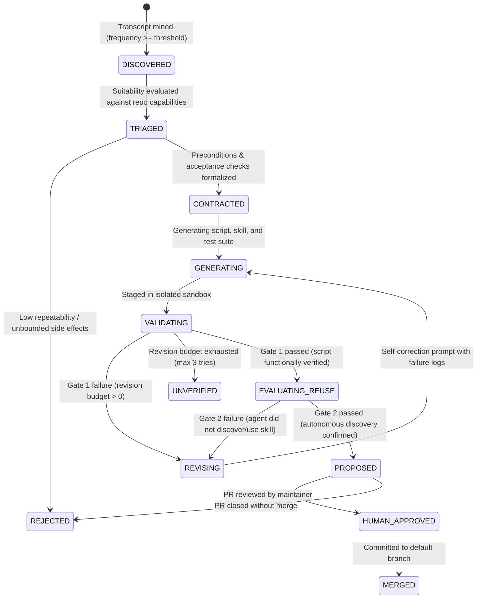

# MAGA Architecture Proposal: Automated Skill & Script Synthesis from Agent Transcripts

**Date:** 19 September 2026  
**Event:** London Tech: Europe Agentic AI Hack  
**Author:** MAGA Team Architecture Handoff  
**Status:** Architecture Proposal & Implementation Plan (Draft PR)

---

## 1. Executive Summary & Problem Framing

### 1.1 The Problem
Coding agents repeatedly reconstruct the same project-specific procedures across independent sessions. Tasks such as configuring isolated worktrees, launching multi-service development stacks with strict port and CORS constraints, or preparing local test databases consume substantial token budgets and developer time. Because agents reconstruct these steps ad-hoc, error rates and omitted steps remain high, even when high-level instructions exist in repository markdown. Crucially, successful procedure traces remain trapped inside ephemeral session logs instead of being promoted into durable, testable, repository-local automation.

### 1.2 Our Solution
**MAGA** is a repository-local learning agent that mines session transcripts for recurring workflows, formalizes strict automation contracts, synthesizes parameterized scripts paired with discoverable Antigravity workspace skills, validates correctness inside an isolated execution harness, verifies that a fresh agent discovers and reuses the skill without prompting, and packages the result into an evidence-backed pull request.

> **Short Pitch:**  
> *“Your agent keeps reconstructing the same procedure. We discover that repetition and turn it into one tested tool.”*

---

## 2. Core Decisions & System Boundaries

Based on team alignment and hackathon constraints:
1. **Target Coding Agent:** Antigravity (CLI version `1.2.7` verified).
2. **Local-First & Asynchronous:** Runs locally; processes transcripts asynchronously post-session or from historical log batches rather than intercepting real-time LLM inference.
3. **Repository Separation:** 
   - **MAGA Repository (`ufs-lab/maga-hackathon`):** Houses the discovery agent, parser, contract synthesizer, isolated validator, evaluation harness, and documentation.
   - **Demonstration Monorepo (Target):** The subject of observation where generated automation (`.agents/skills/`, helper scripts, and tests) is proposed and evaluated.
4. **Local State & Secrets Hygiene:** SQLite manages candidate state, import checkpoints, and execution logs. Raw transcripts, credentials, and local environment tokens remain strictly outside committed Git source. Only sanitized evidence is sent to LLM providers.
5. **Mandatory Two-Gate Loop:**
   - **Gate 1 (Execution Correctness):** The synthesized script passes deterministic contract checks under clean, partial-failure, and conflicting-resource conditions.
   - **Gate 2 (Agent Reuse):** A fresh Antigravity agent discovers and successfully invokes the skill when given a standard natural language task, without being explicitly handed the skill name.
6. **Human Approval:** No automatic merging into upstream branches. The final product is a pull request containing code, skill, test suite, and execution trace evidence.

---

## 3. Antigravity Platform Mechanics (Empirically Verified)

During architectural reconnaissance on the host environment (`linux`, `agy 1.2.7`), the following platform interfaces were empirically confirmed:

### 3.1 Transcript Storage & Schema
- **File System Location:**  
  `~/.gemini/antigravity-cli/brain/<conversation-id>/.system_generated/logs/transcript_full.jsonl` (full log) and `transcript.jsonl` (compact).
- **Format:** JSON Lines (NDJSON).
- **Step Types & Sources:**
  - `USER_EXPLICIT` / `USER_INPUT`: Human user prompt text.
  - `MODEL` / `PLANNER_RESPONSE`: Agent reasoning (`thinking`) and tool invocations (`tool_calls` with `name` and typed `args`).
  - `MODEL` / `GENERIC`: Tool execution outcomes (command stdout, stderr, exit code, duration).
  - `SYSTEM` / `SYSTEM_MESSAGE`: Asynchronous task completion events and background job state updates.
- **Incremental Import:** Files are append-only per conversation, enabling deterministic incremental ingestion tracked by integer `step_index` checkpoints.

### 3.2 Workspace Skill Loading
- **Discovery Root:** Antigravity walks up the current working directory to the Git root looking for `.agents/skills/<skill-name>/SKILL.md`.
- **Packaging Convention:**
  ```text
  .agents/skills/<workflow-name>/
  ├── SKILL.md            # Required: YAML frontmatter (name, description) + instructions
  ├── scripts/            # Parameterized executable scripts (.sh, .py)
  ├── tests/              # Acceptance checks and unit tests
  └── references/         # Extended documentation or contract schemas
  ```
- **Progressive Disclosure:** At session initialization, Antigravity loads only the skill `name` and `description` into the prompt. The primary agent reads the full `SKILL.md` file via `view_file` only when triggered by relevant user intent.
- **Headless Execution for Evaluation:**  
  `agy --print "<prompt>" --dangerously-skip-permissions` allows the evaluation harness to spin up fresh, headless agent sessions against the target repository to test skill discovery and task completion without manual intervention.

---

## 4. End-to-End System Architecture

```mermaid
flowchart TD
    subgraph S1["1. Ingestion & Preprocessing"]
        T["Antigravity Session Transcripts<br/>(~/.gemini/.../transcript_full.jsonl)"] --> ING["Transcript Ingestor & Redactor<br/>(maga.ingest)"]
        ING --> DB[("Local SQLite Store<br/>(maga.store)")]
    end

    subgraph S2["2. Workflow Mining & Candidate Triage"]
        DB --> MINER["Workflow Miner<br/>(maga.mining)"]
        MINER --> CLUST["Sequence Clustering & Frequency Counter"]
        REPO_CONF["Target Monorepo Configuration<br/>(Existing scripts, package.json, CORS rules)"] --> TRIAGE["Suitability & Triage Engine<br/>(Pydantic AI + Gemini)"]
        CLUST --> TRIAGE
    end

    subgraph S3["3. Contract Formalization"]
        TRIAGE -->|Suitable Workflow| CSYN["Contract Synthesizer<br/>(maga.contract)"]
        TRIAGE -->|Existing Tool Exists| SKILL_ONLY["Enhance Skill Metadata"]
        TRIAGE -->|Unbounded / Interactive| REJECT["Mark Unsupported / Agent-Led"]
    end

    subgraph S4["4. Generation & Multi-Gate Verification"]
        CSYN --> GEN["Code & Skill Generator<br/>(maga.codegen)"]
        SKILL_ONLY --> GATE1
        GEN --> GATE1["Gate 1: Isolated Contract Validation<br/>(Local Subprocess / Modal Sandbox)"]
        GATE1 -->|Fails Checks (Budget > 0)| REVISE["Agent Revision Loop"]
        REVISE --> GEN
        GATE1 -->|Fails Checks (Budget = 0)| UNVERIFIED["Mark Unverified (No PR)"]
        GATE1 -->|Passes Acceptance Checks| GATE2["Gate 2: Fresh-Agent Reuse Test<br/>(Headless agy --print)"]
        GATE2 -->|Skill Ignored / Errored| REVISE
    end

    subgraph S5["5. Proposal & Publication"]
        GATE2 -->|Skill Discovered & Executed Successfully| PR_BUILDER["PR Packager & Evidence Exporter<br/>(maga.proposal)"]
        PR_BUILDER --> TARGET_PR["Target Monorepo PR<br/>(.agents/skills/ + scripts/ + tests/)"]
        TARGET_PR --> HUMAN_REV["Human Review & Merge"]
    end
```

---

## 5. Modular Boundaries

The system is organized into decoupled Python modules governed by strict Pydantic schemas:

| Module | Responsibility | Primary Inputs | Primary Outputs |
| :--- | :--- | :--- | :--- |
| `maga.ingest` | Normalizes transcript JSONL lines into structured events; redacts sensitive environment keys and credentials. | Raw `transcript_full.jsonl` | Anonymized `SessionEvent` records in SQLite |
| `maga.store` | Manages SQLite tables, state persistence, step checkpoints, and evaluation results. | Typed records | Relational data (`maga.db`) |
| `maga.mining` | Extracts contiguous command subsequences, tool invocations, and directory contexts; groups recurring patterns. | `SessionEvent` stream | `ProcedureCandidate` clusters |
| `maga.contract` | Formalizes pre/postconditions, inputs, permitted resource impacts, and acceptance assertions. | Ranked candidate + target repo context | `AutomationContract` (Pydantic model) |
| `maga.codegen` | Generates shell/Python automation scripts, Antigravity `SKILL.md`, and contract test suites. | `AutomationContract` | Source files in temporary staging tree |
| `maga.validator` | Executes contract tests against disposable working copies (local sandbox or ephemeral Modal container). | Staged code + test suite | Deterministic test report (`Gate1Result`) |
| `maga.evaluator` | Launches a fresh `agy` process with a neutral prompt to verify autonomous skill discovery and execution. | Clean repo with `.agents/skills/` | Agent reuse report (`Gate2Result`) |
| `maga.proposal` | Formats the pull request branch, generates evidence diffs, and creates the PR against the target monorepo. | Passed artifacts + Gate 1 & 2 logs | Git branch & GitHub Pull Request |

---

## 6. Candidate State Machine & Transitions



---

## 7. Data Architecture & Relational Schema (SQLite)

Local SQLite (`maga.db`) persists pipeline progression without external database dependencies:

```sql
-- Tracked session sources and incremental import watermarks
CREATE TABLE import_sessions (
    session_id TEXT PRIMARY KEY,
    transcript_path TEXT NOT NULL,
    last_ingested_step INTEGER NOT NULL,
    total_steps INTEGER NOT NULL,
    imported_at TIMESTAMP DEFAULT CURRENT_TIMESTAMP
);

-- Canonical event timeline extracted from transcripts
CREATE TABLE session_events (
    event_id TEXT PRIMARY KEY,
    session_id TEXT NOT NULL REFERENCES import_sessions(session_id),
    step_index INTEGER NOT NULL,
    event_type TEXT NOT NULL,     -- 'tool_call', 'tool_result', 'user_input'
    tool_name TEXT,
    command_line TEXT,
    working_dir TEXT,
    exit_code INTEGER,
    sanitized_output TEXT,
    timestamp TIMESTAMP NOT NULL
);

-- Identified procedure candidates
CREATE TABLE procedure_candidates (
    candidate_id TEXT PRIMARY KEY,
    fingerprint TEXT UNIQUE NOT NULL,
    workflow_name TEXT NOT NULL,
    occurrence_count INTEGER NOT NULL,
    status TEXT NOT NULL,         -- 'DISCOVERED', 'CONTRACTED', 'VALIDATING', etc.
    contract_json TEXT,
    revision_count INTEGER DEFAULT 0,
    created_at TIMESTAMP DEFAULT CURRENT_TIMESTAMP,
    updated_at TIMESTAMP DEFAULT CURRENT_TIMESTAMP
);

-- Multi-gate verification results
CREATE TABLE verification_runs (
    run_id TEXT PRIMARY KEY,
    candidate_id TEXT NOT NULL REFERENCES procedure_candidates(candidate_id),
    gate_number INTEGER NOT NULL, -- 1: Script Correctness, 2: Agent Reuse
    passed BOOLEAN NOT NULL,
    stdout_log TEXT,
    stderr_log TEXT,
    execution_duration_ms INTEGER,
    created_at TIMESTAMP DEFAULT CURRENT_TIMESTAMP
);
```

---

## 8. Target Demonstration Monorepo Selection

### 8.1 Evaluated Candidates
1. **Existing Large Monorepos (e.g., `NiGhTTraX/ts-monorepo`):**
   - *Pros:* Realistic multi-package structure with Vite and NestJS.
   - *Cons:* Heavy footprint (Next.js, Storybook, Rollup, 10+ workspaces); slow install times (`pnpm install` > 3 minutes); high risk of environmental fragility during live judging.
2. **Constructed Monorepo Fixture (`demo-fullstack-monorepo`):**
   - *Architecture:* Lightweight pnpm workspace containing:
     - `apps/web`: Vite 6 + React application.
     - `apps/api`: Node/Express backend exposing health checks and strict CORS origin checks (`http://localhost:5173` through `5175`).
     - `packages/config`: Shared port configurations and environment definitions.
   - *Local Verification:* Fast, reproducible setup (< 5s install), zero cloud dependencies.
   - *Labeling:* Explicitly committed under `fixtures/demo-monorepo` and designated as a *constructed demonstration fixture* per hackathon requirements.

### 8.2 Primary Demonstration Workflow: Vite Strict Port & CORS Startup
- **The Problem:** The Vite dev server defaults to incrementing ports when `5173` is occupied (e.g., jumping to `5174` or `5175`). If the backend's allowed CORS origins are pinned strictly to `5173`, requests fail with opaque CORS errors. Agents typically bumble through 4–6 turns discovering ports, killing processes haphazardly, or weakening security policies.
- **The Target Automation Contract:**
  1. Inspects available ports strictly within the backend's allowed origin range (`5173`–`5175`).
  2. Launches Vite with `--strictPort` on a verified free port.
  3. Polls the frontend HTTP endpoint until responsive.
  4. Verifies the backend health handshake with `Origin: http://localhost:<port>`.
  5. Outputs clean JSON: `{"status": "ready", "port": 5174, "pid": 12345}`.
  6. Idempotent: repeated calls detect the already-running server rather than crashing.

---

## 9. Two-Gate Verification Plan

### Gate 1: Execution Correctness
A synthesized script must satisfy four deterministic test cases executed in a disposable sandbox:
1. **Clean Happy Path:** Executes on a clean workspace, starts Vite on port 5173, passes origin check.
2. **Resource Contention:** Port 5173 occupied; script selects next valid port (5174) with strict port configuration, confirms backend alignment.
3. **Exhaustion Handling:** All allowed ports (5173–5175) occupied; script exits cleanly with non-zero exit code and structured error without crashing or altering CORS settings.
4. **Idempotency:** Second invocation detects the existing running process and returns healthy status without spawning duplicates.

### Gate 2: Autonomous Agent Discovery & Reuse
1. A fresh, isolated Git workspace is provided containing only the target repository code and `.agents/skills/vite-dev-server/`.
2. A headless Antigravity process is invoked:
   ```bash
   agy --print "Start the frontend web application and confirm the backend accepts its origin." --dangerously-skip-permissions
   ```
3. **Success Criteria:**
   - The agent inspects `.agents/skills/vite-dev-server/SKILL.md` via `view_file` based on description relevance.
   - The agent executes the synthesized script (`scripts/start.sh`) rather than manually issuing ad-hoc bash loops.
   - The agent returns success in <= 2 turns with zero omitted verification steps.

---

## 10. Partner Technologies & Prize Eligibility

### 10.1 Pydantic & Side Challenge (€1,500)
- **Live Challenge Specification Confirmed:** The Pydantic challenge (*"Change your agent's behavior without touching its code"*) requires deploying an open-weight model on Modal, routing requests through the **Pydantic AI Gateway in Logfire**, and applying an **Optimization Rule** to reshape agent behavior with a visible before/after metric shift.
- **MAGA Integration Strategy:**
  1. **Core Learner:** Implemented using **Pydantic AI** agents with strictly typed Pydantic models for `SessionEvent`, `AutomationContract`, and `VerificationReport`.
  2. **Gateway Optimization Rule:** We define a Gateway Rule (`Style: Terse Automation Synthesizer`) that forces the model to emit minimal, shell-compliant automation contracts with 60%+ output token reduction and zero conversational preamble.
  3. **Gateway Guardrail (Bonus):** A gateway protection rule that redacts sensitive environment tokens (`API_KEY=...`, `SECRET=...`) at the Gateway ingress, verified via an echo test.
  4. **Deliverables:** Side-by-side prompt comparisons and public Logfire trace links demonstrating before-and-after token efficiency.

### 10.2 Modal & Side Challenge (€1,500)
- **Modal Role:** Provides ephemeral, serverless sandboxes (`modal.Function`) to execute Gate 1 validation tests against clean repository checkouts, isolating process execution from the host OS.
- **Credit Voucher Status:** Modal credit code is pending retrieval from team coordination. The local subprocess sandbox operates identically as a fallback.

### 10.3 Google DeepMind / Gemini
- **Gemini Role:** Powers the contract extraction, edge-case generation, and script revision routines within Pydantic AI.

---

## 11. Explicit Unknowns & Risk Registry

| Risk / Unknown | Impact | Mitigation Strategy |
| :--- | :--- | :--- |
| **Modal Credit Code Unretrieved** | Cannot run remote Modal GPU endpoints without account credits. | Core MVP runs sandbox tests locally using isolated subprocesses/worktrees; Modal runner is implemented as a modular backend activated once credentials are supplied. |
| **Pydantic Gateway Latency** | Gateway rule propagation or Logfire trace generation could delay live demos. | Run baseline and optimized traces early (Phase 4); capture deterministic local logs and static trace URLs in PR. |
| **`gcpuser1` GitHub Permissions** | User account has `READ` access to `ufs-lab/maga-hackathon`. Direct push to `origin` is blocked. | Created fork `gcpuser1/maga-hackathon`. All PRs and branches are pushed to fork and proposed across repositories via `gh pr create`. |
| **Antigravity CLI Subshell State** | Subprocess environment variables inside `agy` print mode might differ from interactive shell. | Tests verify scripts run with explicit parameters and shebangs (`#!/usr/bin/env bash`), avoiding shell alias dependencies. |

---

## 12. Minimal Viable End-to-End Implementation Plan (Countdown to 19:00 London)

**Current Time:** 14:15 BST | **Submission Deadline:** 19:00 BST (**~4h 45m remaining**)

```text
14:15 - 14:45  Phase 1: Demonstration Fixture & Real Transcript Generation
               - Build lightweight `fixtures/demo-monorepo` (Vite + Express backend with CORS).
               - Run `agy` 3 times on the fixture to generate authentic repetition transcripts.

14:45 - 15:30  Phase 2: Core Ingest & Mining Engine (`maga.ingest`, `maga.store`, `maga.mining`)
               - Parse real JSONL transcripts into SQLite.
               - Detect repeated command sequences and tool invocations.

15:30 - 16:30  Phase 3: Contract Synthesis & Code Generation (`maga.contract`, `maga.codegen`)
               - Implement Pydantic AI agent to generate `AutomationContract`.
               - Synthesize `start.sh`, `SKILL.md`, and contract unit tests.

16:30 - 17:15  Phase 4: Two-Gate Verification Engine (`maga.validator`, `maga.evaluator`)
               - Gate 1: Run isolated test suite against Vite port scenarios.
               - Gate 2: Run headless `agy --print` to prove skill discovery.

17:15 - 18:00  Phase 5: Pydantic Gateway / Logfire Tracing & Side-Challenge Evidence
               - Route synthesis request through Pydantic AI Gateway / Logfire.
               - Record before/after optimization rule token traces for the challenge.

18:00 - 18:45  Phase 6: PR Packaging, Documentation & 2-Minute Demo Recording
               - Generate proposal PR into target fixture.
               - Complete comprehensive root README and demo video recording.

18:45 - 19:00  Phase 7: Submission & Final Verification
               - Verify all repository links, submission form, and prize opt-ins.
```
