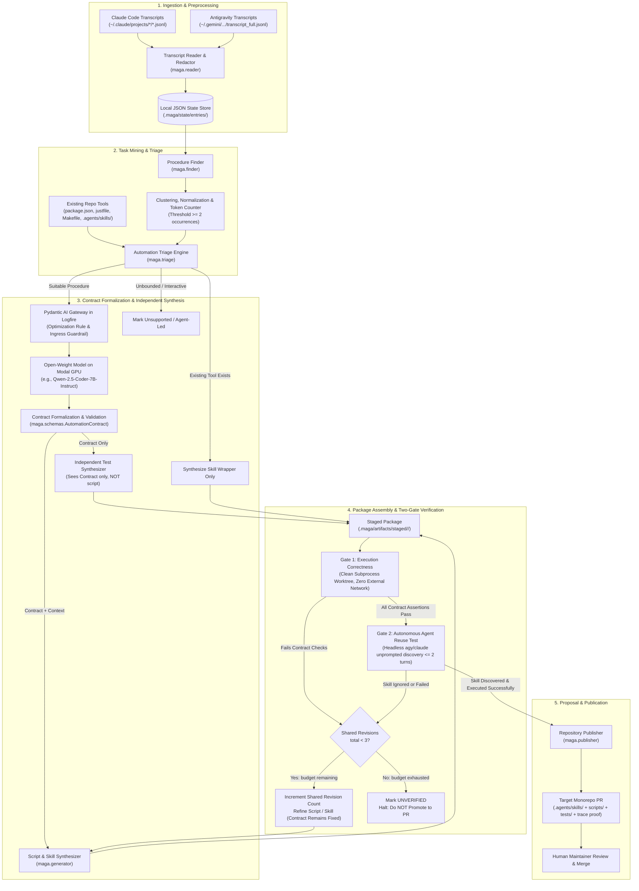

# MAGA Architecture Proposal: Automated Skill & Script Synthesis from Agent Transcripts

**Date:** 19 September 2026  
**Event:** London Tech: Europe Agentic AI Hack  
**Author:** MAGA Team Architecture Handoff  
**Status:** Architecture Proposal & Implementation Plan (Draft PR)

---

## 1. Executive Summary & Problem Framing

### 1.1 The Problem
Coding agents repeatedly reconstruct the same project-specific procedures. This consumes time and tokens. Required steps can be missed, even when documented. Successful sessions contain useful procedures; failed attempts reveal missing steps and checks. The system uses both as evidence for reusable automation.

### 1.2 Our Solution
**MAGA** discovers repeated procedures in session transcripts, assesses their suitability for automation, formalizes an **automation contract**, generates tested parameterized scripts paired with discoverable workspace skills, verifies execution and unprompted agent reuse, and publishes human-reviewable proposals.

Reference architecture specification: [From session transcripts to tested tools](https://from-session-transcripts-to-tested-tools.ledger-rocket.here.now/)

> **Short Pitch:**  
> *“Find repeated procedures. Turn them into scripts. Give agents skills that call those scripts.”*

---

## 2. Terminology & Core Decisions

### 2.1 Standard Terminology
Aligned strictly with the team's specification:
* **Session:** One recorded interaction between a person and a coding agent, including tool use.
* **Transcript:** The recorded messages, tool calls, and tool results from a session.
* **Transcript entry:** One recorded item: a message, a tool call, or a tool result (used uniformly instead of generic "event").
* **Task:** A goal the agent tries to complete, spanning one or many transcript entries.
* **Procedure:** A sequence of steps to achieve a specific outcome across tasks.
* **Candidate:** A procedure proposed for automation, pending triage and verification.
* **Triage:** The decision to generate new automation, reuse existing automation, request clarification, or reject.
* **Script:** Executable code that performs the procedure and checks its result.
* **Skill:** Instructions teaching an agent when and how to call the script.
* **Automation contract:** The formal specification of inputs, preconditions, permitted changes, postconditions, rerun behaviour, failure behaviour, and acceptance checks.
* **Package:** The script, skill, tests, and contract documentation for one procedure.
* **Verifier:** The component that tests a package against its contract (Execution Correctness) and evaluates unprompted agent discovery (Agent Reuse). Out comes: `pass`, `fail`, or `inconclusive`.
* **Repository publisher:** Proposes a Git branch and human-reviewable PR/MR.

### 2.2 Core Architectural Decisions
1. **Target Coding Agents & Standard Format:** Supports **Claude Code** (`~/.claude/projects/*/*.jsonl`) and **Antigravity** (`~/.gemini/antigravity-cli/brain/*/...`). Standardized output format is **`SKILL.md`** workspace skills paired with parameterized shell scripts.
2. **Independent Acceptance Check Synthesis:** Test generation is strictly decoupled from script implementation. Two separate model calls are dispatched from the immutable `AutomationContract`:
   - *Test Generator Call:* Sees only the contract specification and repository constraints; never inspects the generated script.
   - *Script Generator Call:* Sees the contract and repository constraints.
   This guarantees objective, non-circular verification.
3. **Local-First & Asynchronous:** Runs locally; processes transcripts asynchronously from historical logs rather than intercepting real-time LLM inference.
4. **Repository Separation:** 
   - **MAGA Repository (`ufs-lab/maga-hackathon`):** Houses the discovery agent, contract synthesizer, isolated validator, evaluation harness, and documentation.
   - **Demonstration Monorepo (Target):** The subject of observation where generated automation (`.agents/skills/`, helper scripts, and tests) is proposed and evaluated.
5. **Local File & Artifact Storage (No SQLite in MVP):** Per team agreement, all state, checkpoints, entries, candidates, contracts, and test runs are stored as structured **local JSON files and artifact directories** under `.maga/state/` and `.maga/artifacts/`. Raw transcripts, credentials, and local tokens remain strictly outside committed Git source.
6. **Execution Isolation vs. Unconfined Developer Execution:** Temporary directories or Git worktrees provide *clean filesystem checkouts*, not process or security containment. Setting a working directory or `--add-dir` does NOT constitute an OS security boundary, nor does environment variable stripping prevent reading host credential files (`~/.ssh/`, `~/.config/gh/`, etc.). Therefore:
   - For permission-disabled evaluation (`--dangerously-skip-permissions`), evaluation **must run in an actual isolated container or virtualized sandbox** (e.g. Modal) where host files and credentials do not exist.
   - When running locally without containerization, execution is explicitly designated as **unconfined developer-host execution** running with the user's full privileges.
7. **Shared Bounded Revision Budget with Fixed Acceptance Contract:** A strict combined limit across both Gate 1 (Script Validation) and Gate 2 (Agent Reuse) of `MAX_TOTAL_REVISIONS = 3`. If the budget is exhausted at either gate, the candidate transitions to `UNVERIFIED` and is not promoted to a PR. During repair, the **acceptance contract remains strictly fixed**; only the generated script implementation or skill prompt description may be revised. Modifying the contract itself invalidates prior triage and requires restarting the lifecycle.
8. **Existing Tool Lookup Before Synthesis:** Prior to synthesizing new scripts, MAGA inspects repository tool definitions (`package.json`, `justfile`, `Makefile`, `pyproject.toml`, `.agents/skills/`). If an existing tool fulfills the procedure, MAGA wraps or documents it in a `SKILL.md` rather than generating redundant duplicate code.
9. **Human Approval:** No automatic merging into upstream branches. The final product is a pull request containing code, skill, test suite, and execution trace evidence.

---

## 3. Antigravity Platform Mechanics: Empirical Verification & Evidence

During host environment reconnaissance (`linux`, Antigravity CLI), the following mechanics were empirically verified with live execution traces:

### 3.1 CLI Version & Headless Execution Flags
We verified the installed CLI binary and its non-interactive print mode capabilities:

```bash
$ which agy
/home/ravit/.local/bin/agy

$ agy --version
1.2.7

$ agy --help
Usage of agy:
  --dangerously-skip-permissions  Auto-approve all tool permission requests without prompting
  -p, --print                     Run a single prompt non-interactively and print the response
  --output-format                 Output format for print mode (text, json, stream-json)
  --agent                         Agent for the current CLI session
  --mode                          Set the agent execution mode (accept-edits, plan)
```

**Significance:** `agy --print "<task>" --dangerously-skip-permissions` provides the exact headless harness required for Gate 2 autonomous agent discovery and reuse testing.

### 3.2 Real Transcript Storage & Schema Evidence
Transcripts are located at:
`~/.gemini/antigravity-cli/brain/<conversation-id>/.system_generated/logs/transcript_full.jsonl`

We inspected real transcript entries from the current active session (`bfd3ba3d-91a5-464b-94da-16a639085229`). Below are exact, sanitized records illustrating the three fundamental step types:

**1. User Input (`USER_INPUT`, `USER_EXPLICIT`):**
```json
{
  "step_index": 0,
  "source": "USER_EXPLICIT",
  "type": "USER_INPUT",
  "status": "DONE",
  "created_at": "2026-09-19T13:00:48Z",
  "content": "<USER_REQUEST>\n# MAGA hackathon — full project context... [truncated]"
}
```

**2. Model Tool Invocation (`PLANNER_RESPONSE`, `MODEL`):**
```json
{
  "step_index": 6,
  "source": "MODEL",
  "type": "PLANNER_RESPONSE",
  "status": "DONE",
  "created_at": "2026-09-19T13:00:54Z",
  "tool_calls": [
    {
      "name": "run_command",
      "args": {
        "CommandLine": "git status && git remote -v && git branch -a && git log -n 5 --oneline",
        "Cwd": "/home/ravit/repos/maga-hackathon",
        "RequestedTerminalID": "term-1",
        "RunPersistent": true,
        "WaitMsBeforeAsync": 5000,
        "toolAction": "Checking git status and history",
        "toolSummary": "Inspect git repository state"
      }
    }
  ]
}
```

**3. Execution Result (`GENERIC`, `MODEL`):**
```json
{
  "step_index": 7,
  "source": "MODEL",
  "type": "GENERIC",
  "status": "DONE",
  "created_at": "2026-09-19T13:00:55Z",
  "content": "Created At: 2026-09-19T14:00:55+01:00\nCompleted At: 2026-09-19T14:01:04+01:00\n\nThe command exited with code 0.\nOutput:\nOn branch main\nYour branch is up to date with 'origin/main'.\nnothing to commit, working tree clean\n..."
}
```

**Significance:**
- Ingestion is append-only and incremental using monotonic integer `step_index` watermarks.
- Model tool calls contain typed arguments (`CommandLine`, `Cwd`, `WaitMsBeforeAsync`).
- Tool execution results in subsequent `GENERIC` steps contain deterministic exit codes, stdout, and stderr.

### 3.3 Workspace Skill Loading & Progressive Disclosure Evidence
Verified from Antigravity's built-in reference documentation at:  
`/home/ravit/.gemini/antigravity-cli/builtin/skills/agy-customizations/docs/skills.md`

```text
Discovery Path: .agents/skills/<skill_name>/SKILL.md at repository root
Structure:
  skills/<skill_name>/
  ├── SKILL.md          # Required: YAML frontmatter (name, description)
  ├── scripts/          # Parameterized scripts and utilities
  ├── examples/         # Reference implementations
  └── tests/            # Acceptance tests

Progressive Disclosure:
- Only `name` and `description` from YAML frontmatter are injected into the agent's context initially.
- The full content of `SKILL.md` is loaded only if the model explicitly triggers it.
- Highest precedence: Workspace Project (.agents/) overrides global and built-in skills.
```


---

## 4. End-to-End System Architecture



---

## 5. Modular Boundaries & Architecture Components

The system implements the 6 core components defined in the architecture specification, using local JSON file storage:

| Specification Component | Python Module | Responsibility | Primary Inputs | Primary Outputs |
| :--- | :--- | :--- | :--- | :--- |
| **1. Transcript reader** | `maga.reader` | Reads Claude Code (`~/.claude/projects/*/*.jsonl`) and Antigravity (`~/.gemini/.../transcript*.jsonl`) transcripts, normalizes steps into unified `Entry` objects, redacts sensitive tokens, and tracks incremental session watermarks. Never executes commands from transcripts. | Raw JSONL session logs | Normalized `Entry` records in `.maga/state/entries/` |
| **2. Procedure finder** | `maga.finder` | Groups related entries into `Episode` objects, mines recurring command signatures and tool sequences with threshold $\ge 2$ occurrences (or $\ge 3$ repair attempts in one session), applies token normalization (ports, paths, hashes, timestamps), and produces `Candidate` and `Evidence` records. | `Entry` records | `Candidate` and `Evidence` records in `.maga/state/candidates/` |
| **3. Automation triage** | `maga.triage` | Checks existing repo tools (`package.json`, `justfile`, `Makefile`, `pyproject.toml`, `.agents/skills/`) to avoid duplication. Dispatches contract synthesis to the Modal GPU open-weight model via Pydantic AI Gateway in Logfire. Validates `AutomationContract` schemas. | Candidates + repo tool definitions | `AutomationContract` in `.maga/state/contracts/` |
| **4. Package generator** | `maga.generator` | Performs two independent generation steps: (1) Contract $\rightarrow$ Test generator (sees only contract, never script), and (2) Contract $\rightarrow$ Script & `SKILL.md` generator. Stages all files in `.maga/artifacts/staged/<candidate_id>/`. | `AutomationContract` | Staged `Package` (`scripts/`, `SKILL.md`, `tests/`) |
| **5. Verifier** | `maga.verifier` | Evaluates package against contract in clean subprocess (Gate 1), and tests unprompted discovery by a fresh agent session in $\le 2$ turns (Gate 2). Enforces shared revision budget (`MAX_TOTAL_REVISIONS = 3`). Outputs `Verdict`. | Staged `Package` + Acceptance checks | `Verdict` (`pass`, `fail`, `inconclusive`) in `.maga/state/verification/` |
| **6. Repository publisher** | `maga.publisher` | Generates proposal branch and human-reviewable PR with runtime execution evidence, token delta metrics, and Logfire trace links. A human maintainer makes the final merge decision. | Verified `Package` + `Verdict` | Git branch & GitHub Pull Request |

---

## 6. Candidate State Machine & Bounded Revision Loop

A critical architectural guarantee is that **both Gate 1 and Gate 2 share a single bounded revision budget** (`MAX_TOTAL_REVISIONS = 3`), and **the acceptance contract remains strictly fixed during repair**:
- If a package fails functional contract checks in Gate 1, or if a fresh agent in Gate 2 fails to discover or correctly execute the skill, a shared revision counter increments.
- The repair loop refines only the **generated script implementation or skill prompt description**. It **never** weakens or refines the acceptance contract to make failing tests pass.
- Modifying the contract itself invalidates the candidate and terminates the autonomous repair loop, requiring fresh human/triage review.
- If the combined revisions reach the limit (`total_revisions >= 3`), the pipeline transitions immediately to `UNVERIFIED` and permanently terminates without creating a pull request.

```mermaid
stateDiagram-v2
    [*] --> DISCOVERED: Task finder detects recurring procedure
    DISCOVERED --> TRIAGED: Automation triage evaluates candidate
    
    TRIAGED --> REJECTED: Low repeatability / unbounded side effects / unsafe
    TRIAGED --> CLARIFICATION_REQUESTED: Unknown prerequisites / insufficient evidence
    TRIAGED --> CONTRACTED: Preconditions & acceptance checks formalized (FIXED)
    
    CONTRACTED --> GENERATING: Package generator creates script, skill, tests (independent)
    GENERATING --> VALIDATING: Verifier runs Gate 1 contract checks in clean subprocess
    
    VALIDATING --> REVISING: Gate 1 failure (total_revisions < 3)
    VALIDATING --> UNVERIFIED: Gate 1 failure (total_revisions >= 3 or inconclusive)
    
    VALIDATING --> EVALUATING_REUSE: Gate 1 passed (script functionally verified)
    
    EVALUATING_REUSE --> REVISING: Gate 2 failure (total_revisions < 3)
    EVALUATING_REUSE --> UNVERIFIED: Gate 2 failure (total_revisions >= 3)
    
    REVISING --> GENERATING: Self-correction prompt with failure logs (script/skill only; contract fixed)
    
    EVALUATING_REUSE --> PROPOSED: Gate 2 passed (unprompted discovery confirmed)
    
    PROPOSED --> HUMAN_APPROVED: PR reviewed by human maintainer
    PROPOSED --> REJECTED: PR closed without merge
    HUMAN_APPROVED --> MERGED: Merged into default branch
```



---

## 7. Data Architecture: Local JSON & Artifact Storage

Per team agreement, SQLite is eliminated from the MVP in favor of structured **local JSON files and artifact directories** under `.maga/`:

```text
.maga/
├── state/
│   ├── import_checkpoints.json              # Ingest watermarks per session
│   ├── entries/
│   │   └── <session_id>.json                # Normalized, sanitized Entry records
│   ├── episodes/
│   │   └── <session_id>_episodes.json       # Extracted goal-directed Episode sequences
│   ├── candidates/
│   │   └── <candidate_id>.json              # Mined Candidate & Evidence records
│   ├── contracts/
│   │   └── <candidate_id>.json              # Formalized Pydantic AutomationContract
│   └── verification/
│       └── <candidate_id>_verdict.json      # Gate 1 & Gate 2 Verdict and trace data
└── artifacts/
    └── staged/
        └── <candidate_id>/                  # Generated Package files prior to publication
            ├── SKILL.md
            ├── scripts/
            │   └── start.sh
            └── tests/
                └── test_start.py
```

### 7.1 The 7 Core Pydantic Schemas (`maga.schemas`)

```python
from pydantic import BaseModel, Field
from typing import List, Dict, Any, Optional, Literal
from datetime import datetime

class Entry(BaseModel):
    """Normalized single interaction step across Claude Code & Antigravity."""
    entry_id: str
    session_id: str
    step_index: int
    source: Literal["user", "model", "system"]
    entry_type: Literal["user_input", "tool_call", "tool_result", "generic_message"]
    tool_name: Optional[str] = None
    command_line: Optional[str] = None
    working_dir: Optional[str] = None
    args: Optional[Dict[str, Any]] = None
    exit_code: Optional[int] = None
    content: Optional[str] = None
    sanitized_output: Optional[str] = None
    tokens_in: Optional[int] = None
    tokens_out: Optional[int] = None
    timestamp: datetime

class Episode(BaseModel):
    """Extracted sequence of related actions aiming at a specific sub-task or goal."""
    episode_id: str
    session_id: str
    goal: str
    entries: List[Entry]
    success: bool
    repair_iterations: int = 0
    duration_ms: int = 0

class Evidence(BaseModel):
    """Empirical observations justifying automation candidate synthesis."""
    session_ids: List[str]
    observed_occurrences: int
    baseline_turns_mean: float
    baseline_tokens_mean: int
    failure_traces: List[str] = Field(default_factory=list)
    common_pitfalls: List[str] = Field(default_factory=list)

class Candidate(BaseModel):
    """Mined procedure pattern proposed for automation triage."""
    candidate_id: str
    title: str
    command_sequence: List[str]
    normalized_template: str
    frequency: int
    evidence: Evidence
    triage_status: Literal["pending", "accepted", "rejected", "clarification_needed"] = "pending"
    rejection_reason: Optional[str] = None

class AutomationContract(BaseModel):
    """Formal specification governing script implementation and independent test synthesis."""
    candidate_id: str
    workflow_name: str
    intent: str = Field(..., description="High-level goal and human summary")
    inputs: Dict[str, Any] = Field(..., description="Parameters, defaults, and validation bounds")
    preconditions: List[str] = Field(..., description="Environmental requirements prior to execution")
    permitted_changes: List[str] = Field(..., description="Bounded filesystem/process effects allowed")
    postconditions: List[str] = Field(..., description="Verifiable state upon successful execution")
    invariants: List[str] = Field(..., description="Strict negative constraints (e.g. do not weaken CORS)")
    rerun_behaviour: str = Field(..., description="Idempotent handling when already running/configured")
    failure_behaviour: str = Field(..., description="Safe termination, cleanup traps, and error reporting")
    acceptance_checks: List[str] = Field(..., description="Deterministic test cases for Gate 1")

class Package(BaseModel):
    """Staged automation bundle ready for verification and proposal."""
    candidate_id: str
    script_path: str
    skill_path: str
    test_path: str
    contract: AutomationContract

class Verdict(BaseModel):
    """Evaluation outcome for Gate 1 and Gate 2 verification."""
    candidate_id: str
    gate_number: Literal[1, 2]
    outcome: Literal["pass", "fail", "inconclusive"]
    total_revisions: int
    test_results: Dict[str, Any]
    stdout_log: str
    stderr_log: str
    token_delta_percent: Optional[float] = None
    execution_duration_ms: int
    timestamp: datetime
```

---

## 8. Target Demonstration Monorepo Selection & Consistent Workflow Scenario

### 8.1 Evaluated Candidates
1. **Existing Large Monorepos (e.g., `NiGhTTraX/ts-monorepo`):**
   - *Pros:* Realistic multi-package structure with Vite and NestJS.
   - *Cons:* Heavy footprint (Next.js, Storybook, Rollup, 10+ workspaces); slow install times (`pnpm install` > 3 minutes); high risk of environmental fragility during live judging.
2. **Constructed Monorepo Fixture (`demo-fullstack-monorepo`):**
   - *Architecture:* Lightweight pnpm workspace containing:
     - `apps/web`: Vite 6 + React application.
     - `apps/api`: Node/Express backend exposing health checks and strict CORS origin validation.
     - `packages/config`: Authoritative port and origin definitions (`packages/config/ports.json`).
   - *Local Verification:* Fast, reproducible setup (< 5s install), zero external dependencies.
   - *Labeling:* Explicitly committed under `fixtures/demo-monorepo` and designated as a *constructed demonstration fixture* per hackathon requirements.

### 8.2 Demonstration Scenarios: Vite Strict Port Allocation & CORS Alignment

To avoid contradiction, the fixture defines **one consistent configuration** and evaluates **two distinct comparisons** (successful startup under contention vs. safe failure under exhaustion):

* **Authoritative Configuration:**
  - `packages/config/ports.json` specifies permitted frontend ports: `[5173, 5174]`.
  - `apps/api/src/server.js` configures CORS whitelist strictly to: `["http://localhost:5173", "http://localhost:5174"]`.
  - Port `5175` and above are **strictly unpermitted** by the backend CORS policy.

* **Comparison 1: One Permitted Port Available (Contention → Successful Startup):**
  - **Setup:** Port `5173` is occupied by an external service; Port `5174` is free.
  - **Baseline Agent (Without Skill):** Asked: *"Start the web frontend and verify that the backend accepts requests from it."* We observe its actual, unscripted trajectory: whether it starts on port 5174 with strict port binding, whether it verifies the backend CORS origin handshake, or whether it omits verification steps. We measure its actual turns, tool calls, elapsed time, and token usage rather than predetermining them.
  - **Generated Automation (`scripts/start.sh` + skill):** Discovers 5173 is occupied, selects 5174, launches Vite with `--strictPort 5174`, verifies HTTP response, verifies backend health with `Origin: http://localhost:5174`, outputs structured JSON, and reliably completes the workflow.

* **Comparison 2: All Permitted Ports Occupied (Exhaustion → Clean Failure):**
  - **Setup:** Both port `5173` and port `5174` are occupied by active external services.
  - **Baseline Agent (Without Skill):** Vite defaults to auto-incrementing and naively starts on unpermitted port **5175**. When the backend rejects requests with CORS failure (`HTTP 403 Forbidden: Origin http://localhost:5175 not permitted`), we measure how the unassisted agent responds—whether it attempts to stop unrelated external services, modify backend CORS rules in server files, or loop indefinitely.
  - **Generated Automation (`scripts/start.sh` + skill):** Strictly respects configuration bounds. Detects both permitted ports (`5173`, `5174`) are occupied. Refuses to bind unpermitted port 5175. Refuses to alter backend CORS configuration or kill unrelated services. Immediately exits with a clean, structured non-zero error:  
    `{"status": "error", "reason": "all_permitted_ports_exhausted", "tried": [5173, 5174]}`.

* **The Synthesized Automation Contract:**
  1. **Inputs:** Target workspace (`apps/web`), permitted ports list (`[5173, 5174]`), backend health URL (`http://localhost:4000/api/health`).
  2. **Preconditions:** Node.js runtime available, backend server running on port 4000.
  3. **Permitted Changes:** May launch a single Vite process bound strictly to an available port in `[5173, 5174]`. May terminate stale un-responsive PIDs owned by the current workspace.
  4. **Postconditions:** Vite is actively serving on a permitted port (`5173` or `5174`). Backend health check passes with `Origin: http://localhost:<port>`. Emits structured JSON: `{"status": "ready", "port": 5174, "pid": 12345}`.
  5. **Rerun Behaviour (Idempotent):** If a healthy Vite instance is already running on a permitted port, reports healthy state without spawning duplicate processes.
  6. **Failure Behaviour:** If *both* permitted ports are occupied, immediately halts with exit code 1 and structured error without altering CORS or launching on unpermitted ports.
  7. **Acceptance Checks:** 
     - Case A (Clean): Port 5173 free -> binds 5173, passes origin check.
     - Case B (Contention): Port 5173 busy, 5174 free -> binds 5174 with `--strictPort`, passes origin check.
     - Case C (Exhaustion): Ports 5173 and 5174 busy -> exits with error, does not launch on 5175.
     - Case D (Idempotency): Second call returns existing PID without error.

---

## 9. Two-Gate Verification: Sandboxing & Execution Boundaries

A key architectural distinction is that **temporary directories and Git worktrees provide clean workspace checkouts, NOT process or security sandboxing**. Neither setting a working directory nor passing `--add-dir` constitutes an OS security boundary; an agent with shell access can navigate up directories and inspect host paths. Similarly, stripping environment variables does not prevent reading on-disk credential files (`~/.ssh/`, `~/.config/gh/`, `~/.netrc`). We define explicit execution boundaries for both gates:

### 9.1 Gate 1: Script Execution Correctness
* **Objective:** Verify that the synthesized script satisfies all 4 acceptance cases (clean, contention, exhaustion, idempotency) defined in the fixed contract.
* **Modal Ephemeral Sandbox (Containerized):**
  - Validation tests execute inside a disposable Linux container (`modal.Function`) with pinned capabilities and an ephemeral filesystem.
  - The container has no access to host filesystem paths, host network interfaces, or ambient host API keys.
  - Test fixtures are copied into the container; disposable resources are automatically destroyed when the container terminates.
* **Local Subprocess Fallback (Unconfined Execution):**
  - When running locally without Modal, tests execute in a clean Git worktree under a dedicated temporary directory (`/tmp/maga_test_XXXXXX/`).
  - **Explicit Boundary:** Local execution is explicitly recognized as **unconfined developer-host execution** running with the user's full privileges. Local cleanup traps (`EXIT INT TERM`) and localhost binding provide developer convenience and hygiene, not security isolation.

### 9.2 Gate 2: Autonomous Agent Discovery & Reuse
* **Objective:** Prove that a fresh Antigravity session receives an ordinary, unprompted task description (e.g., *"Start the web frontend and verify backend connectivity"*) and autonomously discovers and executes the skill without being handed the script name.
* **Execution Boundary for Headless `agy --dangerously-skip-permissions`:**
  - Running `agy` with permission checks disabled allows the agent to execute shell commands without user confirmation prompts.
  - **Required Execution Model:**
    1. **Containerized Sandbox (Preferred):** To safely evaluate permission-disabled runs, `agy` **must run inside an actual isolated container or virtualized sandbox** (e.g. Modal or Docker) where host credentials and parent filesystems do not exist.
    2. **Local Fallback (Unconfined Execution):** If executed on the developer host without containerization, permissions must either be retained (interactive confirmation) OR local execution must be explicitly documented and treated as **completely unconfined execution with host privileges**. Never claim directory confinement or security isolation from CLI flags.
    3. **Discovery Assertion:** The verifier inspects the agent's transcript to confirm:
       - The agent inspected `.agents/skills/vite-dev-server/SKILL.md` via `view_file` based on description relevance.
       - The agent executed `scripts/start.sh` rather than ad-hoc bash trial-and-error.

---

## 10. Partner Challenge Integrations & Prize Eligibility

### 10.1 Pydantic Side Challenge (€1,500)
* **Official Requirement:** *"Run an open-weight model on your own Modal GPU through the Pydantic AI Gateway, and change your agent's behavior without touching its code."*
* **MAGA Architectural Pipeline:**
  ```text
  Sanitized Transcript Entries 
      │
      ▼
  maga.triage (Analysis Task: Extract Contract from Repetition)
      │
      ▼
  Pydantic AI Gateway in Logfire (Routes request, applies optimization rule & guardrail)
      │
      ▼
  Modal GPU Endpoint (Open-weight model: Qwen-2.5-Coder-7B-Instruct / Llama-3.1-8B-Instruct)
      │
      ▼
  Logfire Tracing (Captures baseline vs. optimized latency, tokens, and outputs)
      │
      ▼
  maga.contract (Pydantic Schema Validation & Semantic Completeness Checks)
  ```

* **Gateway Optimization Rule (Without Touching Agent Code):**
  - **Rule Name:** `Style: Terse Contract Synthesizer` (Action: `Transform`).
  - **Injected Instruction:** *"Emit strictly valid, minimal JSON adhering to the AutomationContract schema. Omit all conversational preamble, reasoning paragraphs, and sign-offs."*
  - **Experimental Target:** Target an experimental **40%–60% reduction in output tokens** compared to the unoptimized baseline run on the identical prompt and model.

* **Schema Validation vs. Semantic & Behavioral Correctness:**
  - **Pydantic schema validation verifies structural shape and field types; it does NOT prove contract correctness.** A minimal JSON response can contain every required field while omitting essential requirements inside those fields (e.g. dropping permitted port constraints, omitting CORS verification steps, or dropping the invariant against modifying CORS rules).
  - To prove contract correctness:
    1. **Semantic Completeness Evaluation:** Explicit assertions verify that essential domain requirements (permitted port bounds, CORS verification postconditions, refusal to weaken CORS, process cleanup) are present in the generated contract fields.
    2. **Independent Acceptance Execution:** The downstream test suite generated from the contract is executed in Gate 1 against the independent acceptance test cases. If the contract was stripped of required constraints, the resulting implementation or test suite fails execution against the real fixture.
    3. Token reduction is only considered successful if the resulting package passes all independent acceptance checks.

* **Gateway Guardrail (Bonus Category):**
  - **Protection:** Ingress pattern targeting leaked secrets (`API_KEY=.*`, `Bearer .*`, `ghp_.*`).
  - **Action:** `Redact` (replaces with placeholder `[REDACTED_SECRET]`).
  - **Echo Test:** An echo test proves the Modal-hosted model received only the redacted placeholder, demonstrating perimeter defense before model ingress.

### 10.2 Modal Side Challenge (€1,500)
* **Modal Role:**
  1. Hosts the open-weight model endpoint for the Pydantic AI Gateway.
  2. Executes disposable, containerized Gate 1 test runs (`modal.Function`) against clean repository fixtures.
* **Credit Voucher Status:** Shared credit token is pending from team coordination. The local runner operates as an unconfined fallback while credentials are retrieved.

### 10.3 Google DeepMind / Gemini
* **Role:** Gemini models power transcript reasoning, parameter extraction, and failure diagnostic analysis.

---

## 11. Explicit Unknowns & Risk Registry

| Risk / Unknown | Impact | Mitigation Strategy |
| :--- | :--- | :--- |
| **Modal Credit Code Unretrieved** | Cannot spin up remote Modal GPU endpoint without active account credits. | Core MVP runs sandbox tests locally using clean worktrees; Modal runner is implemented as a pluggable backend ready to activate immediately upon credential entry. |
| **Pydantic Gateway Latency** | Gateway rule propagation or Logfire trace generation could delay live demos. | Run baseline and optimized traces early (Phase 4); capture deterministic local logs and static trace URLs in PR. |
| **`gcpuser1` GitHub Permissions** | User account has `READ` access to `ufs-lab/maga-hackathon`. Direct push to `origin` is blocked. | Created fork `gcpuser1/maga-hackathon`. All PRs and branches are pushed to fork and proposed across repositories via `gh pr create`. |
| **Local Unconfined Execution** | Running `agy --dangerously-skip-permissions` locally lacks kernel isolation. | Strict directory confinement, environment secret scrubbing, and signal-trapped process cleanup. |

---

## 12. Minimal Viable End-to-End Implementation Plan (Walking Skeleton First)

**Submission Deadline:** 19:00 BST

```text
Phase 1: Schemas & Walking Skeleton Core (15:10 - 15:50)
- maga/schemas.py: Implement the 7 Pydantic models (Entry, Episode, Candidate, Evidence, AutomationContract, Package, Verdict).
- Golden Contract: Write the canonical hand-written AutomationContract for the port-aware dev server.
- maga.generator & maga.verifier: Implement independent test generation and Gate 1 (subprocess) / Gate 2 (agy) runners.

Phase 2: Demonstration Monorepo Fixture & Baseline Traces (15:50 - 16:30)
- fixtures/demo-monorepo: Setup Vite + Express CORS workspace with strict ports [5173, 5174].
- Capture genuine baseline failure traces under port contention and port exhaustion.

Phase 3: Mining Engine & Triage Gateway (16:30 - 17:15)
- maga.reader: Ingest Claude Code and Antigravity JSONL session logs.
- maga.finder: Cluster command sequences (threshold >= 2), extract parameters, check existing repo tools.
- maga.triage: Pydantic AI Gateway in Logfire -> Modal GPU model with optimization rule (token reduction).

Phase 4: End-to-End Verification & Evidence Assembly (17:15 - 18:00)
- Run full MAGA pipeline on captured traces: Discover -> Contract -> Generate -> Gate 1 -> Gate 2.
- maga.publisher: Generate proposal PR with trace proof, token deltas, and before/after comparisons.

Phase 5: Documentation & 2-Minute Video Demo (18:00 - 18:45)
- Complete root README.md with clear diagrams, reproduction instructions, and Logfire trace links.
- Record 2-minute demonstration video highlighting discovery, independent testing, and unprompted agent reuse.

Phase 6: Submission & Final Polish (18:45 - 19:00)
- Verify repository clean status, PR links, and submit hackathon entry before 19:00 BST.
```
