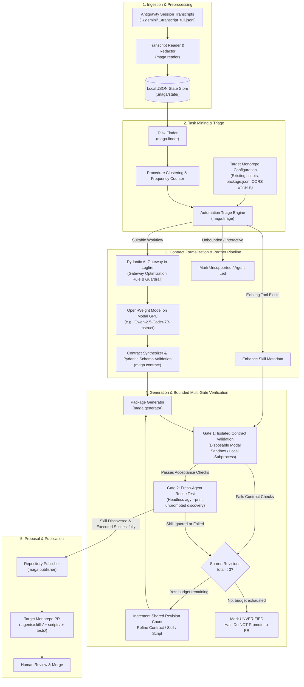
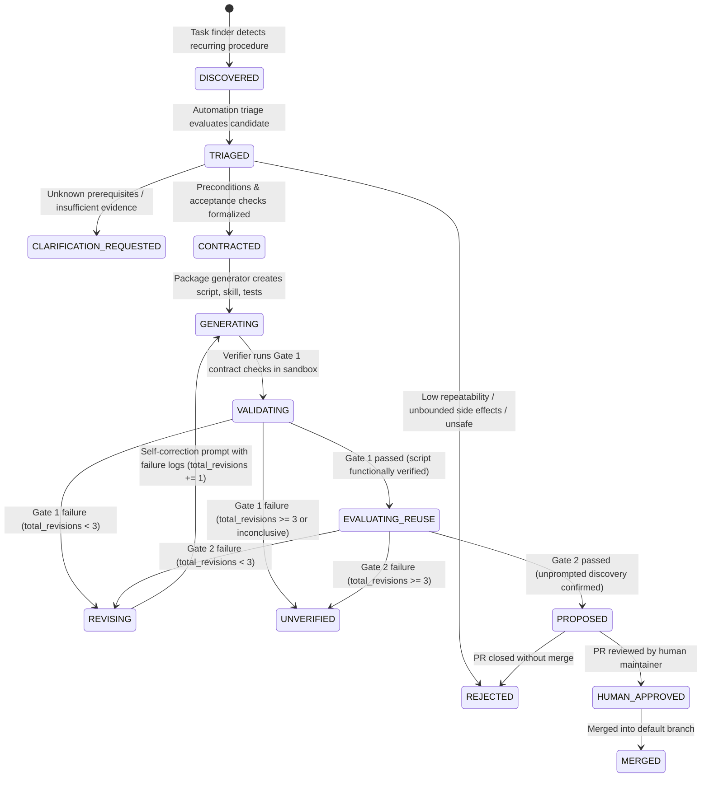

# MAGA Architecture Proposal: Automated Skill & Script Synthesis from Agent Transcripts

**Date:** 19 September 2026  
**Event:** London Tech: Europe Agentic AI Hack  
**Author:** MAGA Team Architecture Handoff  
**Status:** Architecture Proposal & Implementation Plan (Draft PR)

---

## 1. Executive Summary & Problem Framing

### 1.1 The Problem
Coding agents repeatedly reconstruct the same project-specific procedures. This consumes time and tokens. Required steps can be missed, even when documented. Successful sessions contain useful procedures; failed attempts reveal missing steps and checks. The system uses both as evidence for reusable automation.

### 1.2 Our Solution
**MAGA** discovers repeated procedures in session transcripts, assesses their suitability for automation, formalizes an **automation contract**, generates tested parameterized scripts paired with discoverable workspace skills, verifies execution and unprompted agent reuse, and publishes human-reviewable proposals.

Reference architecture specification: [From session transcripts to tested tools](https://from-session-transcripts-to-tested-tools.ledger-rocket.here.now/)

> **Short Pitch:**  
> *“Find repeated procedures. Turn them into scripts. Give agents skills that call those scripts.”*

---

## 2. Terminology & Core Decisions

### 2.1 Standard Terminology
Aligned strictly with the team's specification:
* **Session:** One recorded interaction between a person and a coding agent, including tool use.
* **Transcript:** The recorded messages, tool calls, and tool results from a session.
* **Transcript entry:** One recorded item: a message, a tool call, or a tool result (used uniformly instead of generic "event").
* **Task:** A goal the agent tries to complete, spanning one or many transcript entries.
* **Procedure:** A sequence of steps to achieve a specific outcome across tasks.
* **Candidate:** A procedure proposed for automation, pending triage and verification.
* **Triage:** The decision to generate new automation, reuse existing automation, request clarification, or reject.
* **Script:** Executable code that performs the procedure and checks its result.
* **Skill:** Instructions teaching an agent when and how to call the script.
* **Automation contract:** The formal specification of inputs, preconditions, permitted changes, postconditions, rerun behaviour, failure behaviour, and acceptance checks.
* **Package:** The script, skill, tests, and contract documentation for one procedure.
* **Verifier:** The component that tests a package against its contract (Execution Correctness) and evaluates unprompted agent discovery (Agent Reuse). Out comes: `pass`, `fail`, or `inconclusive`.
* **Repository publisher:** Proposes a Git branch and human-reviewable PR/MR.

### 2.2 Core Architectural Decisions
1. **Target Coding Agent:** Antigravity (CLI version `1.2.7` empirically verified).
2. **Local-First & Asynchronous:** Runs locally; processes transcripts asynchronously from historical logs rather than intercepting real-time LLM inference.
3. **Repository Separation:** 
   - **MAGA Repository (`ufs-lab/maga-hackathon`):** Houses the discovery agent, contract synthesizer, isolated validator, evaluation harness, and documentation.
   - **Demonstration Monorepo (Target):** The subject of observation where generated automation (`.agents/skills/`, helper scripts, and tests) is proposed and evaluated.
4. **Local File & Artifact Storage (No SQLite in MVP):** Per team agreement, all state, checkpoints, entries, candidates, contracts, and test runs are stored as structured **local JSON files and artifact directories** under `.maga/state/` and `.maga/artifacts/`. Raw transcripts, credentials, and local tokens remain strictly outside committed Git source.
5. **Execution Isolation vs. Workspace Separation:** Temporary directories or Git worktrees provide *clean filesystem checkouts*, not process or security containment. Generated code executed locally runs with the host user's full privileges. For true process sandboxing, ephemeral containerized execution (e.g. Modal) is used. When running locally, Gate 2 headless execution (`agy --dangerously-skip-permissions`) is explicitly constrained to the isolated demo directory with scrubbed environment credentials and restricted localhost network bounds.
6. **Shared Bounded Revision Budget:** A strict combined limit across both Gate 1 (Script Validation) and Gate 2 (Agent Reuse) of `MAX_TOTAL_REVISIONS = 3`. If the budget is exhausted at either gate, the candidate transitions to `UNVERIFIED` and is not promoted to a PR.
7. **Human Approval:** No automatic merging into upstream branches. The final product is a pull request containing code, skill, test suite, and execution trace evidence.

---

## 3. Antigravity Platform Mechanics: Empirical Verification & Evidence

During host environment reconnaissance (`linux`, Antigravity CLI), the following mechanics were empirically verified with live execution traces:

### 3.1 CLI Version & Headless Execution Flags
We verified the installed CLI binary and its non-interactive print mode capabilities:

```bash
$ which agy
/home/ravit/.local/bin/agy

$ agy --version
1.2.7

$ agy --help
Usage of agy:
  --dangerously-skip-permissions  Auto-approve all tool permission requests without prompting
  -p, --print                     Run a single prompt non-interactively and print the response
  --output-format                 Output format for print mode (text, json, stream-json)
  --agent                         Agent for the current CLI session
  --mode                          Set the agent execution mode (accept-edits, plan)
```

**Significance:** `agy --print "<task>" --dangerously-skip-permissions` provides the exact headless harness required for Gate 2 autonomous agent discovery and reuse testing.

### 3.2 Real Transcript Storage & Schema Evidence
Transcripts are located at:
`~/.gemini/antigravity-cli/brain/<conversation-id>/.system_generated/logs/transcript_full.jsonl`

We inspected real transcript entries from the current active session (`bfd3ba3d-91a5-464b-94da-16a639085229`). Below are exact, sanitized records illustrating the three fundamental step types:

**1. User Input (`USER_INPUT`, `USER_EXPLICIT`):**
```json
{
  "step_index": 0,
  "source": "USER_EXPLICIT",
  "type": "USER_INPUT",
  "status": "DONE",
  "created_at": "2026-09-19T13:00:48Z",
  "content": "<USER_REQUEST>\n# MAGA hackathon — full project context... [truncated]"
}
```

**2. Model Tool Invocation (`PLANNER_RESPONSE`, `MODEL`):**
```json
{
  "step_index": 6,
  "source": "MODEL",
  "type": "PLANNER_RESPONSE",
  "status": "DONE",
  "created_at": "2026-09-19T13:00:54Z",
  "tool_calls": [
    {
      "name": "run_command",
      "args": {
        "CommandLine": "git status && git remote -v && git branch -a && git log -n 5 --oneline",
        "Cwd": "/home/ravit/repos/maga-hackathon",
        "RequestedTerminalID": "term-1",
        "RunPersistent": true,
        "WaitMsBeforeAsync": 5000,
        "toolAction": "Checking git status and history",
        "toolSummary": "Inspect git repository state"
      }
    }
  ]
}
```

**3. Execution Result (`GENERIC`, `MODEL`):**
```json
{
  "step_index": 7,
  "source": "MODEL",
  "type": "GENERIC",
  "status": "DONE",
  "created_at": "2026-09-19T13:00:55Z",
  "content": "Created At: 2026-09-19T14:00:55+01:00\nCompleted At: 2026-09-19T14:01:04+01:00\n\nThe command exited with code 0.\nOutput:\nOn branch main\nYour branch is up to date with 'origin/main'.\nnothing to commit, working tree clean\n..."
}
```

**Significance:**
- Ingestion is append-only and incremental using monotonic integer `step_index` watermarks.
- Model tool calls contain typed arguments (`CommandLine`, `Cwd`, `WaitMsBeforeAsync`).
- Tool execution results in subsequent `GENERIC` steps contain deterministic exit codes, stdout, and stderr.

### 3.3 Workspace Skill Loading & Progressive Disclosure Evidence
Verified from Antigravity's built-in reference documentation at:  
`/home/ravit/.gemini/antigravity-cli/builtin/skills/agy-customizations/docs/skills.md`

```text
Discovery Path: .agents/skills/<skill_name>/SKILL.md at repository root
Structure:
  skills/<skill_name>/
  ├── SKILL.md          # Required: YAML frontmatter (name, description)
  ├── scripts/          # Parameterized scripts and utilities
  ├── examples/         # Reference implementations
  └── tests/            # Acceptance tests

Progressive Disclosure:
- Only `name` and `description` from YAML frontmatter are injected into the agent's context initially.
- The full content of `SKILL.md` is loaded only if the model explicitly triggers it.
- Highest precedence: Workspace Project (.agents/) overrides global and built-in skills.
```


---

## 4. End-to-End System Architecture



---

## 5. Modular Boundaries & Architecture Components

The system implements the 6 components defined in the architecture specification, using local JSON file storage:

| Specification Component | Python Module | Responsibility | Primary Inputs | Primary Outputs |
| :--- | :--- | :--- | :--- | :--- |
| **1. Transcript reader** | `maga.reader` | Reads selected local transcript files, normalizes entries, redacts sensitive keys/secrets, and tracks watermarks. Never executes commands from transcripts. | Raw `transcript_full.jsonl` | Anonymized `TranscriptEntry` records in `.maga/state/transcript_entries/` |
| **2. Task finder** | `maga.finder` | Groups related entries into tasks, identifies recurring procedures across tasks, and separates observed facts from inferences. | `TranscriptEntry` records | `ProcedureCandidate` records in `.maga/state/candidates/` |
| **3. Automation triage** | `maga.triage` | Assesses suitability against repository conventions; dispatches contract synthesis to the open-weight model on Modal via the Pydantic AI Gateway in Logfire. Validates output against Pydantic schema. | Candidates + existing scripts/skills | `AutomationContract` (Pydantic model) in `.maga/state/contracts/` |
| **4. Package generator** | `maga.generator` | Generates candidate script, skill (`SKILL.md`), and unit tests into an isolated staging directory (`.maga/artifacts/staged/`). Keeps secrets out of code and docs. | Accepted `AutomationContract` | Staged package (`scripts/`, `SKILL.md`, `tests/`) |
| **5. Verifier** | `maga.verifier` | Evaluates package against contract in disposable sandbox (Gate 1), and tests unprompted discovery by a fresh agent (Gate 2). Enforces a shared revision budget (`MAX_TOTAL_REVISIONS = 3`). Outputs `pass`, `fail`, or `inconclusive`. | Staged package + acceptance checks + clean testbed | `VerificationReport` (`pass`, `fail`, `inconclusive`) in `.maga/state/verification/` |
| **6. Repository publisher** | `maga.publisher` | Generates proposal branch and human-reviewable PR/MR with read-back verification. A human decides whether to merge. | Verified package + maintainer approval | Git branch & GitHub Pull Request |

---

## 6. Candidate State Machine & Bounded Revision Loop

A critical architectural guarantee is that **both Gate 1 and Gate 2 share a single bounded revision budget** (`MAX_TOTAL_REVISIONS = 3`). If a package fails functional contract checks in Gate 1, or if a fresh agent in Gate 2 fails to discover or correctly execute the skill, a shared revision counter increments. If the combined revisions reach the limit, the pipeline transitions immediately to `UNVERIFIED` and permanently terminates without creating a pull request.



---

## 7. Data Architecture: Local JSON & Artifact Storage

Per team agreement, SQLite is eliminated from the MVP in favor of structured **local JSON files and artifact directories** under `.maga/`:

```text
.maga/
├── state/
│   ├── import_checkpoints.json              # Ingest watermarks per session
│   ├── transcript_entries/
│   │   └── <session_id>.json                # Normalized, sanitized transcript entries
│   ├── candidates/
│   │   └── <candidate_id>.json              # Mined procedure candidates and triage status
│   ├── contracts/
│   │   └── <candidate_id>.json              # Formalized Pydantic AutomationContract
│   └── verification/
│       └── <candidate_id>_run_<run_id>.json # Gate 1 & Gate 2 logs and revision count
└── artifacts/
    └── staged/
        └── <candidate_id>/                  # Generated package files prior to publication
            ├── SKILL.md
            ├── scripts/
            │   └── start.sh
            └── tests/
                └── test_start.sh
```

### 7.1 Schema Specifications (Pydantic Models)

```python
from pydantic import BaseModel, Field
from typing import List, Optional, Literal
from datetime import datetime

class TranscriptEntryRecord(BaseModel):
    entry_id: str
    session_id: str
    step_index: int
    entry_type: Literal["user_message", "tool_call", "tool_result", "system_message"]
    tool_name: Optional[str] = None
    command_line: Optional[str] = None
    working_dir: Optional[str] = None
    exit_code: Optional[int] = None
    sanitized_output: Optional[str] = None
    timestamp: datetime

class AutomationContract(BaseModel):
    candidate_id: str
    workflow_name: str
    inputs: dict = Field(..., description="Parameters and allowed values")
    preconditions: List[str] = Field(..., description="Prerequisites before execution")
    permitted_changes: List[str] = Field(..., description="Bounded filesystem/process effects")
    postconditions: List[str] = Field(..., description="Required verifiable state upon success")
    rerun_behaviour: str = Field(..., description="Idempotent handling of existing instances")
    failure_behaviour: str = Field(..., description="Safe termination, PID cleanup, and error reporting")
    acceptance_checks: List[str] = Field(..., description="Deterministic verification assertions")

class VerificationRunRecord(BaseModel):
    run_id: str
    candidate_id: str
    gate_number: Literal[1, 2]
    outcome: Literal["pass", "fail", "inconclusive"]
    total_revisions: int
    stdout_log: str
    stderr_log: str
    execution_duration_ms: int
    timestamp: datetime
```

---

## 8. Target Demonstration Monorepo Selection & Consistent Workflow Scenario

### 8.1 Evaluated Candidates
1. **Existing Large Monorepos (e.g., `NiGhTTraX/ts-monorepo`):**
   - *Pros:* Realistic multi-package structure with Vite and NestJS.
   - *Cons:* Heavy footprint (Next.js, Storybook, Rollup, 10+ workspaces); slow install times (`pnpm install` > 3 minutes); high risk of environmental fragility during live judging.
2. **Constructed Monorepo Fixture (`demo-fullstack-monorepo`):**
   - *Architecture:* Lightweight pnpm workspace containing:
     - `apps/web`: Vite 6 + React application.
     - `apps/api`: Node/Express backend exposing health checks and strict CORS origin validation.
     - `packages/config`: Authoritative port and origin definitions (`packages/config/ports.json`).
   - *Local Verification:* Fast, reproducible setup (< 5s install), zero external dependencies.
   - *Labeling:* Explicitly committed under `fixtures/demo-monorepo` and designated as a *constructed demonstration fixture* per hackathon requirements.

### 8.2 Consistent Demonstration Scenario: Vite Strict Port Allocation & CORS Alignment

To avoid contradiction, the fixture defines **one consistent configuration** where the baseline reliably fails and the automated tool reliably succeeds:

* **Authoritative Configuration:**
  - `packages/config/ports.json` specifies permitted frontend ports: `[5173, 5174]`.
  - `apps/api/src/server.js` configures CORS whitelist strictly to: `["http://localhost:5173", "http://localhost:5174"]`.
  - Port `5175` and above are **strictly unpermitted** by the backend CORS policy.

* **The Baseline Failure (Agent Without Skill):**
  1. Both port `5173` and port `5174` are occupied (e.g. by dangling background test processes or stale services).
  2. An unassisted coding agent is asked: *"Start the web frontend and verify that the backend accepts requests from it."*
  3. The agent naively issues `npm run dev` in `apps/web`.
  4. Vite detects that ports 5173 and 5174 are busy. Because standard Vite defaults to port-incrementing, it automatically increments to port **5175** and prints `Local: http://localhost:5175/`.
  5. The agent assumes frontend startup succeeded. However, when it checks the backend with a browser request or origin check (`Origin: http://localhost:5175`), the backend rejects it with:  
     `HTTP 403 Forbidden: CORS policy: Origin http://localhost:5175 is not permitted.`
  6. The agent flounders across 4–6 turns: attempting ad-hoc restarts, killing random processes, or attempting to weaken backend CORS security rules.

* **The Synthesized Automation Contract:**
  1. **Inputs:** Target workspace (`apps/web`), permitted ports list (`[5173, 5174]`), backend health URL (`http://localhost:4000/api/health`).
  2. **Preconditions:** Node.js runtime available, backend server running on port 4000.
  3. **Permitted Changes:** May launch a single Vite process bound strictly to an available port in `[5173, 5174]`. May terminate stale un-responsive PIDs owned by the current workspace.
  4. **Postconditions:** Vite is actively serving on a permitted port (`5173` or `5174`). Backend health check passes with `Origin: http://localhost:<port>`. Emits structured JSON: `{"status": "ready", "port": 5174, "pid": 12345}`.
  5. **Rerun Behaviour (Idempotent):** If a healthy Vite instance is already running on a permitted port, reports healthy state without spawning duplicate processes.
  6. **Failure Behaviour:** If *both* permitted ports are genuinely occupied by active external services, immediately halts with exit code 1 and structured error:  
     `{"status": "error", "reason": "all_permitted_ports_exhausted", "tried": [5173, 5174]}`  
     **Strict Invariant:** Never launch on unpermitted port 5175; never modify backend CORS configuration.
  7. **Acceptance Checks:** 
     - Case A (Clean): Port 5173 free -> binds 5173, passes origin check.
     - Case B (Contention): Port 5173 busy, 5174 free -> binds 5174 with `--strictPort`, passes origin check.
     - Case C (Exhaustion): Ports 5173 and 5174 busy -> exits with error, does not launch on 5175.
     - Case D (Idempotency): Second call returns existing PID without error.

---

## 9. Two-Gate Verification: Sandboxing & Execution Boundaries

A key architectural distinction is that **temporary directories and Git worktrees do NOT provide process or security sandboxing**. A local subprocess running in a clean worktree still possesses full host user privileges. We define explicit execution boundaries for both gates:

### 9.1 Gate 1: Script Execution Correctness
* **Objective:** Verify that the synthesized script satisfies all 4 acceptance cases (clean, contention, exhaustion, idempotency) defined in the contract.
* **Modal Ephemeral Sandbox (Containerized):**
  - Validation tests execute inside a disposable Linux container (`modal.Function`) with pinned capabilities and an ephemeral filesystem.
  - The container has no access to host filesystem paths, host network interfaces, or ambient host API keys.
  - Test fixtures are copied into the container; disposable resources are automatically destroyed when the container terminates.
* **Local Subprocess Fallback (Unconfined Workspace Isolation):**
  - When running locally without Modal, tests execute in a clean Git worktree under a dedicated temporary directory (`/tmp/maga_test_XXXXXX/`).
  - **Explicit Boundary:** Local execution is explicitly designated as *unconfined*. To mitigate risks, the runner strips host secrets (`GH_TOKEN`, `ANTHROPIC_API_KEY`, etc.) from child process environments, binds strictly to `127.0.0.1`, and registers a POSIX signal trap (`EXIT INT TERM`) to kill all spawned child PIDs.

### 9.2 Gate 2: Autonomous Agent Discovery & Reuse
* **Objective:** Prove that a fresh Antigravity session receives an ordinary, unprompted task description (e.g., *"Start the web frontend and verify backend connectivity"*) and autonomously discovers and executes the skill without being handed the script name.
* **Execution Boundary for Headless `agy --dangerously-skip-permissions`:**
  - Running `agy` with permission checks disabled allows the agent to execute shell commands without user confirmation prompts.
  - **Safety Boundaries Applied:**
    1. **Working Directory Lockdown:** The `agy` process is invoked with `--add-dir` strictly limited to the clean demonstration worktree, preventing navigation to parent repositories.
    2. **Environment Scrubbing:** Ambient developer tokens, SSH keys, and cloud credentials are removed from the execution environment.
    3. **Deterministic Timeout:** A hard timeout (e.g. 90 seconds) terminates the agent if it enters an infinite loop or fails to select a tool.
    4. **Discovery Assertion:** The verifier inspects the agent's transcript to confirm:
       - The agent inspected `.agents/skills/vite-dev-server/SKILL.md` via `view_file` based on description relevance.
       - The agent executed `scripts/start.sh` rather than ad-hoc bash trial-and-error.

---

## 10. Partner Challenge Integrations & Prize Eligibility

### 10.1 Pydantic Side Challenge (€1,500)
* **Official Requirement:** *"Run an open-weight model on your own Modal GPU through the Pydantic AI Gateway, and change your agent's behavior without touching its code."*
* **MAGA Architectural Pipeline:**
  ```text
  Sanitized Transcript Entries 
      │
      ▼
  maga.triage (Analysis Task: Extract Contract from Repetition)
      │
      ▼
  Pydantic AI Gateway in Logfire (Routes request, applies optimization rule & guardrail)
      │
      ▼
  Modal GPU Endpoint (Open-weight model: Qwen-2.5-Coder-7B-Instruct / Llama-3.1-8B-Instruct)
      │
      ▼
  Logfire Tracing (Captures baseline vs. optimized latency, tokens, and outputs)
      │
      ▼
  maga.contract (Validates generated JSON against Pydantic AutomationContract schema)
  ```

* **Gateway Optimization Rule (Without Touching Agent Code):**
  - **Rule Name:** `Style: Terse Contract Synthesizer` (Action: `Transform`).
  - **Injected Instruction:** *"Emit strictly valid, minimal JSON adhering to the AutomationContract schema. Omit all conversational preamble, reasoning paragraphs, and sign-offs."*
  - **Experimental Target:** Target an experimental **40%–60% reduction in output tokens** compared to the unoptimized baseline run on the identical prompt and model.
  - **Correctness Check:** Every output is parsed into the Pydantic `AutomationContract` model. If a terse output drops required fields or fails schema constraints, it is rejected — proving that token efficiency cannot compromise contract correctness.

* **Gateway Guardrail (Bonus Category):**
  - **Protection:** Ingress pattern targeting leaked secrets (`API_KEY=.*`, `Bearer .*`, `ghp_.*`).
  - **Action:** `Redact` (replaces with placeholder `[REDACTED_SECRET]`).
  - **Echo Test:** An echo test proves the Modal-hosted model received only the redacted placeholder, demonstrating perimeter defense before model ingress.

### 10.2 Modal Side Challenge (€1,500)
* **Modal Role:**
  1. Hosts the open-weight model endpoint for the Pydantic AI Gateway.
  2. Executes disposable, containerized Gate 1 test runs (`modal.Function`) against clean repository fixtures.
* **Credit Voucher Status:** Shared credit token is pending from team coordination. The local runner operates as an unconfined fallback while credentials are retrieved.

### 10.3 Google DeepMind / Gemini
* **Role:** Gemini models power transcript reasoning, parameter extraction, and failure diagnostic analysis.

---

## 11. Explicit Unknowns & Risk Registry

| Risk / Unknown | Impact | Mitigation Strategy |
| :--- | :--- | :--- |
| **Modal Credit Code Unretrieved** | Cannot spin up remote Modal GPU endpoint without active account credits. | Core MVP runs sandbox tests locally using clean worktrees; Modal runner is implemented as a pluggable backend ready to activate immediately upon credential entry. |
| **Pydantic Gateway Latency** | Gateway rule propagation or Logfire trace generation could delay live demos. | Run baseline and optimized traces early (Phase 4); capture deterministic local logs and static trace URLs in PR. |
| **`gcpuser1` GitHub Permissions** | User account has `READ` access to `ufs-lab/maga-hackathon`. Direct push to `origin` is blocked. | Created fork `gcpuser1/maga-hackathon`. All PRs and branches are pushed to fork and proposed across repositories via `gh pr create`. |
| **Local Unconfined Execution** | Running `agy --dangerously-skip-permissions` locally lacks kernel isolation. | Strict directory confinement, environment secret scrubbing, and signal-trapped process cleanup. |

---

## 12. Minimal Viable End-to-End Implementation Plan (Countdown to 19:00 London)

**Current Time:** 14:25 BST | **Submission Deadline:** 19:00 BST (**~4h 35m remaining**)

```text
14:25 - 14:55  Phase 1: Demonstration Fixture & Authentic Transcript Generation
               - Build lightweight `fixtures/demo-monorepo` (Vite + Express CORS).
               - Seed 5173 & 5174 contention; run `agy` 3 times to capture genuine baseline failure traces.

14:55 - 15:40  Phase 2: Core Ingest & Mining Engine (maga.reader, maga.storage, maga.finder)
               - Parse real JSONL transcripts into `.maga/state/`.
               - Detect repeated command sequences and tool invocations.

15:40 - 16:30  Phase 3: Pydantic Gateway Integration & Contract Synthesis (maga.triage, maga.generator)
               - Dispatch contract extraction to Modal-hosted model via Pydantic AI Gateway in Logfire.
               - Record before/after optimization rule token traces for the Pydantic prize.
               - Synthesize `start.sh`, `SKILL.md`, and contract unit tests.

16:30 - 17:15  Phase 4: Bounded Two-Gate Verification Engine (maga.verifier)
               - Gate 1: Run isolated test suite against Vite port scenarios (clean, contention, exhaustion, idempotency).
               - Gate 2: Run headless `agy --print` to prove unprompted skill discovery.
               - Enforce shared revision limit (MAX_TOTAL_REVISIONS = 3).

17:15 - 18:00  Phase 5: Proposal PR & Evidence Assembly (maga.publisher)
               - Generate proposal branch and pull request against the demonstration repository.
               - Attach execution logs, Logfire trace URLs, and diffs.

18:00 - 18:45  Phase 6: Comprehensive Documentation & 2-Minute Video Recording
               - Complete root README with quickstart and architecture diagrams.
               - Record 2-minute demonstration video highlighting problem, repetition discovery, and agent reuse.

18:45 - 19:00  Phase 7: Submission & Final Verification
               - Verify all repository links, submission form, and prize opt-ins before 19:00 deadline.
```
