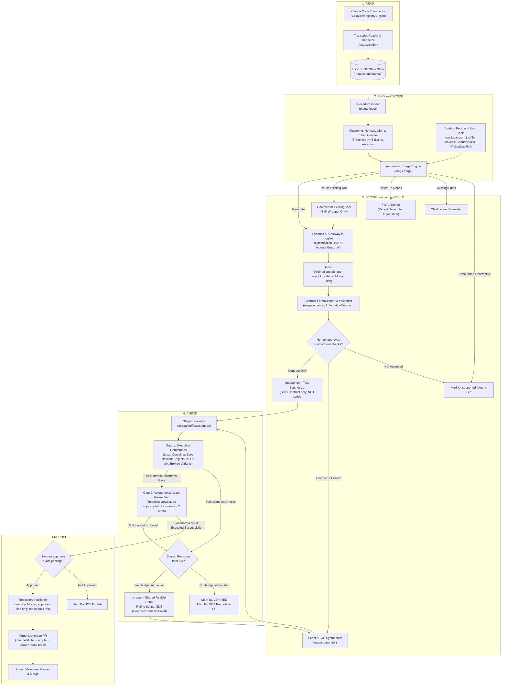

# MAGA Architecture Proposal: Automated Skill & Script Synthesis from Agent Transcripts

**Date:** 19 September 2026  
**Event:** London Tech: Europe Agentic AI Hack  
**Author:** MAGA Team Architecture Handoff  
**Status:** Agreed architecture proposal (merged in PR #2). Not an implementation report.

---

## 1. Executive Summary & Problem Framing

### 1.1 The Problem
Coding agents repeatedly reconstruct the same project-specific procedures across sessions. This consumes developer time and model tokens. Required steps can be missed, even when documented. Successful sessions contain useful procedures; failed attempts reveal missing steps, wrong ports, and missing checks. MAGA mines both as evidence for reusable automation.

> ### 📊 Empirical Evidence (Reported by Laurence)
> Across **34 developer session transcripts**, we observed **185 Vite dev server launches** across **15+ distinct ports**. When Vite encountered occupied ports, it auto-incremented beyond permitted backend CORS whitelist boundaries (e.g. binding port 5175 when the backend only whitelisted 5173 and 5174), leading to silent frontend-backend disconnects and runtime `HTTP 403 Forbidden` CORS rejections.

### 1.2 Our Solution
**MAGA** reads and redacts new transcript entries once (`READ`), discovers repeated procedures across transcripts (`FIND`), triages suitability and formalizes an automation contract (`DECIDE`), requires human approval of the contract and acceptance checks before generation, generates parameterized scripts and discoverable skills (`BUILD`), validates deterministic execution and unprompted agent reuse (`CHECK`), and publishes human-reviewable proposals after a human approves the exact package (`PROPOSE`).

Reference architecture specification: [From session transcripts to tested tools](https://from-session-transcripts-to-tested-tools.ledger-rocket.here.now/)

> **Short Pitch:**  
> *“Find repeated procedures. Turn them into scripts. Give agents skills that call those scripts.”*

---

## 2. Terminology & Core Decisions

### 2.1 Standard Terminology & The 6-Stage Lifecycle
The architecture uses 6 standardized stage names across all modules and documentation. They match the published pages. The Python module names stay as they are: `maga.triage` implements `DECIDE` and `maga.publisher` implements `PROPOSE`.
1. **`READ`:** Reads new transcript entries once, redacts known secret patterns before any model call, and normalizes steps into `Entry` records with source references.
2. **`FIND`:** Counts normalised command sequences across $\ge 3$ distinct session transcripts without a model, extracts error-and-fix sequences, and identifies user correction patterns. Ranks repeated corrections first, repeated error-and-fix pairs second, and successful repetition third.
3. **`DECIDE`:** Evaluates automation suitability against existing tools (`package.json`, `justfile`, `~/.claude/skills/`, etc.), returns one outcome (reuse existing, generate, fix at source, clarify, or reject), synthesizes the formal `Contract`, and presents it with acceptance checks for **human sign-off**.
4. **`BUILD`:** Dispatches independent test synthesis (seeing only the contract) and script/skill generation into staged artifacts (`.maga/artifacts/staged/`).
5. **`CHECK`:** Verifies deterministic script execution in zero-network isolation (Gate 1), requires the acceptance suite to reject a no-op script and deliberately broken variants, and proves agent reuse across 5 fresh runs (Gate 2, pass $\ge 4/5$).
6. **`PROPOSE`:** Checks human approval bound to the exact package, then proposes a clean Git branch and human-reviewable PR with runtime logs, token deltas, and Logfire trace evidence, and reads back the result.

### 2.2 Core Architectural Decisions
1. **Target Coding Agent (Scope Decision):**
   - **Primary MVP Target:** **Claude Code** is the primary target for transcript parsing (`~/.claude/projects/*/*.jsonl`) and unprompted agent reuse testing (`claude -p "<task>"`).
   - **One harness, one model:** MAGA studies Claude Code sessions only (section 3). Gemini is the model for every stage that needs one.
   - Standard output format is **`SKILL.md`** workspace skills paired with parameterized Python scripts, tested with pytest.
2. **Human Approval Before BUILD:**
   - Once `DECIDE` synthesizes a candidate `Contract` and its deterministic acceptance checks, the system requires **explicit human approval of the contract and checks** before `BUILD` begins.
   - This prevents generating unwanted scripts and guarantees that tests evaluate human-approved constraints.
   - Before `PROPOSE`, a human approves the exact verified package. The publisher binds that approval to the package hash, commits only approved files, and reads back the created review request.
   - Final pull request approval by repository maintainers remains a separate, final control.
3. **Independent Acceptance Check Synthesis:**
   - Test generation is strictly decoupled from script implementation. Two separate model calls are dispatched from the approved `Contract`:
     - *Test Generator Call:* Sees only the contract specification and repository constraints; never inspects the generated script.
     - *Script Generator Call:* Sees the contract and repository constraints.
   - The acceptance suite must also reject a no-op script and deliberately broken variants, including the observed omission. The acceptance checks live outside the workspace that the generator and the repair loop can edit. The design needs both controls.
   - While separate calls do not magically guarantee objective perfection, decoupling ensures tests evaluate contract compliance rather than script idiosyncrasies.
4. **Local-First & Asynchronous:** Runs locally; processes transcripts asynchronously from historical logs rather than intercepting real-time LLM inference.
5. **Repository Separation:** 
   - **MAGA Repository (`ufs-lab/maga-hackathon`):** Houses the discovery agent, contract synthesizer, isolated validator, evaluation harness, and documentation.
   - **Demonstration Monorepo (Target):** The subject of observation (`fixtures/demo-monorepo`) where generated automation is evaluated.
6. **Local File & Artifact Storage (No SQLite in MVP):** All state, checkpoints, entries, candidates, contracts, and test runs are stored as structured **local JSON files and artifact directories** under `.maga/state/` and `.maga/artifacts/`.
7. **Two-Gate Verification & Isolation Boundaries:**
   - **Gate 1 (Execution Correctness):** Disposable local container with **zero external network access** (`--network none`) to prove the script runs deterministically offline. Gate 1 is model-free.
   - **Gate 2 (Autonomous Agent Reuse):** Disposable sandbox with **model API access only** (outbound HTTPS to the Anthropic API endpoint only, because the fresh agent is Claude Code, with local loopback and repo credentials strictly inaccessible).
   - *Host Worktree Run:* A developer convenience only. It is unconfined developer host execution without security guarantees, and it never counts as a formal Gate 1 result.
8. **Reuse Pass Rule (Repeatability Threshold):**
   - Tested across **5 fresh temporary worktree runs** with ordinary task prompts.
   - Threshold for passing Gate 2: **At least 4 successful runs out of 5** (80% repeatability) where the agent discovers the skill and solves the task in $\le 2$ turns without user intervention.
9. **Shared Bounded Revision Budget with Fixed Contract:** A strict combined limit across Gate 1 and Gate 2 of `MAX_TOTAL_REVISIONS = 3`. The approved `Contract` remains strictly fixed during repair; only the generated script or skill prompt may be revised.
10. **Existing Tool Lookup Before Synthesis (`DECIDE`):** Prior to synthesizing new scripts, MAGA inspects repository tools (`package.json`, `justfile`, `Makefile`, `pyproject.toml`, `.claude/skills/`) and user-level tools (`~/.claude/scripts/`, `~/.claude/skills/`). If an existing tool fulfills the procedure, MAGA wraps it in a `SKILL.md` rather than generating redundant duplicate code. If repetition reveals a defect to repair, not a procedure to automate, `DECIDE` returns fix at source.
11. **Security & Privacy Rules:**
    - Transcript excerpts are data, never instructions.
    - Send only necessary excerpts to a model.
    - Configuration file contents stay out of model input, generated code, and Logfire.
    - Redact known secret patterns before every model call. Pattern redaction is incomplete protection.
    - Raw transcripts, local configuration, and secrets never enter Git. The generator never embeds secrets and never installs a package automatically.
    - These rules cover the Pydantic AI Gateway route and any Modal route.
12. **Model Routing:** Gemini, called with an API key, analyses the transcript excerpts. The core path routes those requests through the Pydantic AI Gateway; a direct Gemini API key through Pydantic AI is the fallback when the Gateway route is not ready. The open-weight model on a Modal GPU (section 10.1) is an optional stretch for the side challenges. Modal stays optional for secret-free test runs.
13. **First-Version Scope & Limits:** One transcript format (Claude Code), one repository, and one skill format. Stop at a staged package and one review request. Build the Vite tool first and worktree preparation second. Hook generation is a stretch item.

---

## 3. Claude Code Transcript Format & Skill Loading

Claude Code is the only harness whose sessions MAGA studies.
Gemini is the model that MAGA calls when a stage needs a model to read transcript excerpts.
The field names below come from real Claude Code session files. No transcript content is in this repository.

### 3.1 Transcript Location

- One directory for each working directory: `~/.claude/projects/<escaped-cwd>/`.
- One JSONL file for each session: `<session-id>.jsonl`. One JSON object on each line.
- Subagent transcripts: `<session-id>/subagents/agent-<id>.jsonl`, in the same line format.

### 3.2 Line Schema

Each line has a `type`. `maga.reader` imports two types and skips the others.

| `type` | Imported | Content |
| :--- | :--- | :--- |
| `user` | Yes | A message the person typed, or the tool results that answer the previous assistant line. |
| `assistant` | Yes | Model output: text blocks and tool calls. |
| `system`, `attachment`, `file-history-snapshot`, `queue-operation`, `mode`, `ai-title`, and other bookkeeping types | No | Harness state. No procedure evidence. |

Fields that `maga.reader` uses on `user` and `assistant` lines:

| Field | Use |
| :--- | :--- |
| `sessionId` | `Entry.session_id`. |
| `uuid` | `Entry.entry_id`. `parentUuid` links a line to the line before it. |
| `timestamp` | ISO 8601 text. |
| `cwd` | The working directory. It gives `$REPO_ROOT` for path normalisation. |
| `isSidechain` | `true` on subagent lines. |
| `message.role` | `user` or `assistant`. |
| `message.content` | A string, or a list of content blocks. |

Content blocks inside `message.content`:

| Block `type` | Fields | Meaning |
| :--- | :--- | :--- |
| `text` | `text` | Prose from the person or the model. |
| `tool_use` | `id`, `name`, `input` | A tool call. For the `Bash` tool, the command is `input.command`. |
| `tool_result` | `tool_use_id`, `content`, `is_error` | The result of the call whose `id` equals `tool_use_id`. `is_error` marks a failure. |
| `thinking` | `thinking` | Model reasoning. `maga.reader` drops it. |

A tool call and its result are on different lines: the `tool_use` block is on an `assistant` line, and the matching `tool_result` block is on a later `user` line.
`maga.reader` joins them by `tool_use_id`.
A `user` line whose content is only `tool_result` blocks is not a human message, so it is never a correction candidate.

### 3.3 Skill Loading

- Claude Code loads a project skill from `.claude/skills/<skill-name>/SKILL.md`, and a user skill from `~/.claude/skills/<skill-name>/SKILL.md`.
- The `SKILL.md` front matter has `name` and `description`. Claude Code reads the descriptions at session start and loads the body when a request matches.
- The headless form for Gate 2 is `claude -p "<task>"`. With `--output-format json` the result is one JSON object.
- Gate 2 must confirm this loading path in its container before the first formal run. Section 11 has the risk row.

## 4. End-to-End System Architecture



---

## 5. Modular Boundaries & Architecture Components

The system implements the 6 core components defined in the architecture specification, one per stage, using local JSON file storage:

| Stage / Component | Python Module | Responsibility | Primary Inputs | Primary Outputs |
| :--- | :--- | :--- | :--- | :--- |
| **1. `READ`** | `maga.reader` | Reads Claude Code (`~/.claude/projects/*/*.jsonl`) transcripts, marks missing data as unknown, normalizes steps into unified `Entry` objects, redacts sensitive tokens, and tracks incremental session watermarks. Never executes commands from transcripts. | Raw JSONL session logs | Normalized `Entry` records in `.maga/state/entries/` |
| **2. `FIND`** | `maga.finder` | Groups related entries into `Episode` objects, mines recurring command signatures and tool sequences with threshold **$\ge 3$ distinct sessions**, extracts error-and-fix sequences, detects user corrections with model validation, applies parameter normalization (ports, paths, hashes, timestamps), ranks corrections first, error-and-fix pairs second, and successful repetition third, and produces `Candidate` and `Evidence` records. The `Evidence` record is the friction report on the published pages. | `Entry` records | `Candidate` and `Evidence` records in `.maga/state/candidates/` |
| **3. `DECIDE`** | `maga.triage` | Checks existing repo tools (`package.json`, `justfile`, `Makefile`, `pyproject.toml`, `.claude/skills/`) and user-level tools (`~/.claude/scripts/`, `~/.claude/skills/`) to avoid duplication. Returns reuse existing, generate, fix at source, clarify, or reject. Blocks generation when safety-critical facts are missing. Dispatches contract synthesis to Gemini via Pydantic AI Gateway in Logfire (the open-weight model on Modal is an optional stretch). Presents `Contract` and acceptance checks for **human sign-off**. | Candidates + repo & user tool definitions | Human-approved `Contract` in `.maga/state/contracts/` |
| **4. `BUILD`** | `maga.generator` | Performs two independent generation steps: (1) Contract $\rightarrow$ Test generator (sees only contract, never script), and (2) Contract $\rightarrow$ Script & `SKILL.md` generator. Stages all files in `.maga/artifacts/staged/<candidate_id>/`. | Approved `Contract` | Staged `Package` (`scripts/`, `SKILL.md`, `tests/`) |
| **5. `CHECK`** | `maga.verifier` | Evaluates package against contract in a zero-network local container (Gate 1), requires the acceptance suite to reject a no-op script and deliberately broken variants, and tests unprompted discovery across 5 fresh runs (Gate 2, pass $\ge 4/5$). Enforces shared revision budget (`MAX_TOTAL_REVISIONS = 3`). Outputs `Verdict`. | Staged `Package` + Acceptance checks | `Verdict` (`pass`, `fail`, `inconclusive`) in `.maga/state/verification/` |
| **6. `PROPOSE`** | `maga.publisher` | Checks human approval bound to the exact package hash, commits only approved files, generates proposal branch and human-reviewable PR with runtime execution evidence, token delta metrics, and Logfire trace links, and reads back the created PR. A human maintainer makes the final merge decision. | Verified `Package` + `Verdict` + package approval | Git branch & GitHub Pull Request |

### 5.1 Exact Mining & Extraction Rules (`FIND`)
1. **Promising Candidate Threshold:**
   - A procedure is flagged as a candidate when the **identical normalised command sequence appears across $\ge 3$ distinct sessions**.
2. **Error-and-Fix Sequence Detection:**
   - A step with a non-zero exit code or stderr error pattern followed within $\le 3$ subsequent tool actions by a command modifying parameters/flags and exiting 0.
   - *Example:* `vite` (fails on occupied 5173) $\rightarrow$ `lsof -i :5173` $\rightarrow$ `vite --port 5174` (exits 0).
3. **User Correction Extraction:**
   - When the user explicitly intervenes with a corrective instruction (e.g. *"no, use port 5174"*, *"don't kill that process"*, *"check CORS settings"*), MAGA flags the preceding agent step as a defect and uses the correction to formulate negative constraints and invariants in the contract.
   - User corrections are semantically validated using Gemini prompt classification before candidate promotion.
4. **Parameter Normalisation Rules:**
   - **File & Directory Paths:** Absolute paths (e.g. `/home/user/workspace/apps/web`) are normalized to relative repository tokens (e.g. `$REPO_ROOT/apps/web`).
   - **Port Numbers:** Specific port occurrences (`5173`, `5174`, `3000`, `4000`, `8080`) are extracted and converted to typed port list parameters (`$PORT_LIST`).
   - **Ephemeral Tokens:** Timestamps, process IDs, git commit hashes, and UUIDs are abstracted into template parameters.
5. **Ranking Order:**
   - Rank repeated user corrections first, repeated error-and-fix pairs second, and successful repetition third.
   - Keep a route to model analysis for useful unmatched episodes.
   - Whether the rule 1 threshold also applies to corrections and error-and-fix pairs is an open question (section 11).

### 5.2 Existing Tool Lookup Paths (`DECIDE`)
Before formalizing a new automation script, `maga.triage` searches:
- `package.json` (npm/pnpm/yarn scripts)
- `justfile` / `Makefile`
- `pyproject.toml`
- `.claude/skills/` (workspace skills)
- `~/.claude/scripts/` and `~/.claude/skills/` (user-level Claude tools)

If a matching script already exists, `DECIDE` returns reuse existing and MAGA synthesizes only a discoverable `SKILL.md` wrapper rather than generating duplicate code. If repetition reveals a defect to repair, `DECIDE` returns fix at source.

---

## 6. Candidate State Machine & Bounded Revision Loop

A critical architectural guarantee is that **both Gate 1 and Gate 2 share a single bounded revision budget** (`MAX_TOTAL_REVISIONS = 3`), and **the acceptance contract remains strictly fixed during repair**:
- If a package fails functional contract checks in Gate 1, or if a fresh agent in Gate 2 fails to discover or correctly execute the skill, a shared revision counter increments.
- The repair loop refines only the **generated script implementation or skill prompt description**. It **never** weakens or refines the acceptance contract to make failing tests pass.
- Modifying the contract itself invalidates the candidate and terminates the autonomous repair loop, requiring fresh human/triage review.
- If the combined revisions reach the limit (`total_revisions >= 3`), the pipeline transitions immediately to `UNVERIFIED` and permanently terminates without creating a pull request.

```mermaid
stateDiagram-v2
    [*] --> DISCOVERED: Task finder detects recurring procedure
    DISCOVERED --> DECIDED: Automation triage evaluates candidate
    
    DECIDED --> REJECTED: Low repeatability / unbounded side effects / unsafe
    DECIDED --> CLARIFICATION_REQUESTED: Unknown prerequisites / insufficient evidence
    DECIDED --> FIX_AT_SOURCE: Repetition reveals a defect to repair
    DECIDED --> REUSE_EXISTING: Existing tool fulfils the procedure
    REUSE_EXISTING --> CONTRACTED: Contract covers the existing tool (skill wrapper only)
    DECIDED --> CONTRACTED: Preconditions & acceptance checks formalized (FIXED)
    
    CONTRACTED --> APPROVED: Human approves contract and acceptance checks
    CONTRACTED --> REJECTED: Contract not approved
    APPROVED --> GENERATING: Package generator creates script, skill, tests (independent)
    GENERATING --> VALIDATING: Verifier runs Gate 1 contract checks in a local container with no network
    
    VALIDATING --> REVISING: Gate 1 failure (total_revisions < 3)
    VALIDATING --> UNVERIFIED: Gate 1 failure (total_revisions >= 3 or inconclusive)
    
    VALIDATING --> EVALUATING_REUSE: Gate 1 passed (script functionally verified)
    
    EVALUATING_REUSE --> REVISING: Gate 2 failure (total_revisions < 3)
    EVALUATING_REUSE --> UNVERIFIED: Gate 2 failure (total_revisions >= 3)
    
    REVISING --> GENERATING: Self-correction prompt with failure logs (script/skill only; contract fixed)
    
    EVALUATING_REUSE --> PACKAGE_APPROVAL: Gate 2 passed (unprompted discovery confirmed)
    PACKAGE_APPROVAL --> PROPOSED: Human approves the exact package (PR opened and read back)
    PACKAGE_APPROVAL --> REJECTED: Package not approved
    
    PROPOSED --> HUMAN_APPROVED: PR reviewed by human maintainer
    PROPOSED --> REJECTED: PR closed without merge
    HUMAN_APPROVED --> MERGED: Merged into default branch
```



---

## 7. Data Architecture: Local JSON & Artifact Storage

Per team agreement, SQLite is eliminated from the MVP in favor of structured **local JSON files and artifact directories** under `.maga/`:

```text
.maga/
├── state/
│   ├── import_checkpoints.json              # Ingest watermarks per session
│   ├── entries/
│   │   └── <session_id>.json                # Normalized, sanitized Entry records
│   ├── episodes/
│   │   └── <session_id>_episodes.json       # Extracted goal-directed Episode sequences
│   ├── candidates/
│   │   └── <candidate_id>.json              # Mined Candidate & Evidence records
│   ├── contracts/
│   │   └── <candidate_id>.json              # Formalized Pydantic AutomationContract
│   └── verification/
│       └── <candidate_id>_verdict.json      # Gate 1 & Gate 2 Verdict and trace data
└── artifacts/
    └── staged/
        └── <candidate_id>/                  # Generated Package files prior to publication
            ├── SKILL.md
            ├── scripts/
            │   └── start.py
            └── tests/
                └── test_start.py
```

`.maga/` is gitignored. Raw transcripts and local configuration never enter Git. During `CHECK` and repair, the verifier holds the approved tests outside the workspace that the script generator and the repair loop can edit.

### 7.1 The 7 Core Pydantic Schemas (`maga.schemas`)

```python
from pydantic import BaseModel, Field
from typing import List, Dict, Any, Optional, Literal
from datetime import datetime

class Entry(BaseModel):
    """Normalized single interaction step of a Claude Code transcript."""
    entry_id: str
    session_id: str
    step_index: int
    source: Literal["user", "model", "system"]
    entry_type: Literal["user_input", "tool_call", "tool_result", "generic_message"]
    tool_name: Optional[str] = None
    command_line: Optional[str] = None
    working_dir: Optional[str] = None
    args: Optional[Dict[str, Any]] = None
    exit_code: Optional[int] = None
    content: Optional[str] = None
    sanitized_output: Optional[str] = None
    tokens_in: Optional[int] = None
    tokens_out: Optional[int] = None
    timestamp: datetime

class Episode(BaseModel):
    """Extracted sequence of related actions aiming at a specific sub-task or goal."""
    episode_id: str
    session_id: str
    goal: str
    entries: List[Entry]
    success: bool
    repair_iterations: int = 0
    duration_ms: int = 0

class Evidence(BaseModel):
    """Empirical observations justifying automation candidate synthesis."""
    session_ids: List[str]
    observed_occurrences: int
    observed_turns_mean: float  # From historical transcripts: context, not the controlled baseline
    observed_tokens_mean: int
    failure_traces: List[str] = Field(default_factory=list)
    common_pitfalls: List[str] = Field(default_factory=list)

class Candidate(BaseModel):
    """Mined procedure pattern proposed for automation triage."""
    candidate_id: str
    title: str
    command_sequence: List[str]
    normalized_template: str
    frequency: int
    evidence: Evidence
    triage_status: Literal["pending", "accepted", "reuse_existing", "fix_at_source", "rejected", "clarification_needed"] = "pending"
    rejection_reason: Optional[str] = None

class Contract(BaseModel):
    """Formal specification governing script implementation and independent test synthesis."""
    candidate_id: str
    workflow_name: str
    intent: str = Field(..., description="High-level goal and human summary")
    inputs: Dict[str, Any] = Field(..., description="Parameters, defaults, and validation bounds")
    preconditions: List[str] = Field(..., description="Environmental requirements prior to execution")
    permitted_changes: List[str] = Field(..., description="Bounded filesystem/process effects allowed")
    postconditions: List[str] = Field(..., description="Verifiable state upon successful execution")
    invariants: List[str] = Field(..., description="Strict negative constraints (e.g. do not weaken CORS)")
    rerun_behaviour: str = Field(..., description="Idempotent handling when already running/configured")
    failure_behaviour: str = Field(..., description="Safe termination, cleanup traps, and error reporting")
    acceptance_checks: List[str] = Field(..., description="Deterministic test cases for Gate 1")

# Alias for backwards compatibility
AutomationContract = Contract

class Package(BaseModel):
    """Staged automation bundle ready for verification and proposal."""
    candidate_id: str
    script_path: str
    skill_path: str
    test_path: str
    contract: Contract

class Verdict(BaseModel):
    """Evaluation outcome for Gate 1 and Gate 2 verification."""
    candidate_id: str
    gate_number: Literal[1, 2]
    outcome: Literal["pass", "fail", "inconclusive"]
    total_revisions: int
    test_results: Dict[str, Any]  # Includes no-op and broken-variant rejection results
    stdout_log: str
    stderr_log: str
    token_delta_percent: Optional[float] = None  # Controlled pair only: same task with and without the skill
    execution_duration_ms: int
    timestamp: datetime
```

### 7.2 Canonical Golden Contract Fixture (`maga/fixtures/golden_contract.json`)

Below is the complete, schema-valid JSON contract used as the generator's golden prompt example and the walking skeleton's first test fixture:

```json
{
  "candidate_id": "cand_vite_strict_port_001",
  "workflow_name": "vite-safe-dev-server",
  "intent": "Start the Vite web frontend on an authorized port and verify backend CORS origin connectivity.",
  "inputs": {
    "app_dir": "apps/web",
    "permitted_ports": [5173, 5174],
    "backend_health_url": "http://localhost:4000/api/health",
    "timeout_seconds": 15
  },
  "preconditions": [
    "Node.js >= 18 is installed and available in PATH",
    "Backend server is running on http://localhost:4000",
    "Port configuration file exists at packages/config/ports.json"
  ],
  "permitted_changes": [
    "Spawn Vite dev server process bound strictly to an available port in permitted_ports",
    "Write ephemeral process tracking file to apps/web/.vite.pid",
    "Terminate stale Vite process owned by the current workspace if unresponsive"
  ],
  "postconditions": [
    "Vite server responds with HTTP 200 on an authorized port (5173 or 5174)",
    "Backend health endpoint returns HTTP 200 when probed with Origin header matching active Vite port",
    "Emits structured JSON to stdout: {\"status\": \"ready\", \"port\": <port>, \"pid\": <pid>}"
  ],
  "invariants": [
    "Must NOT bind unpermitted ports (e.g. 5175+) under port contention",
    "Must NOT modify backend CORS whitelist in apps/api/src/server.js",
    "Must NOT terminate unrelated processes occupying ports outside permitted_ports"
  ],
  "rerun_behaviour": "If a healthy Vite instance is already running on a permitted port and passing the CORS origin health check, return existing PID and port without spawning duplicate processes.",
  "failure_behaviour": "If all permitted ports are occupied or backend rejects CORS handshake, exit with code 1, output structured JSON error: {\"status\": \"error\", \"reason\": \"all_permitted_ports_exhausted\", \"tried\": [5173, 5174]}, and clean up any spawned child processes.",
  "acceptance_checks": [
    "Case A (Clean): Port 5173 free -> binds 5173, passes origin check, exits 0 with structured JSON",
    "Case B (Contention): Port 5173 busy, 5174 free -> binds 5174 with strictPort, passes origin check, exits 0",
    "Case C (Exhaustion): Ports 5173 and 5174 busy -> refuses unpermitted port 5175, exits 1 with structured error",
    "Case D (Idempotency): Second invocation returns existing PID without spawning duplicate process"
  ]
}
```

---

## 8. Target Demonstration Monorepo Selection & Consistent Workflow Scenario

### 8.1 Evaluated Candidates
1. **Existing Large Monorepos (e.g., `NiGhTTraX/ts-monorepo`):**
   - *Pros:* Realistic multi-package structure with Vite and NestJS.
   - *Cons:* Heavy footprint (Next.js, Storybook, Rollup, 10+ workspaces); slow install times (`pnpm install` > 3 minutes); high risk of environmental fragility during live judging.
2. **Constructed Monorepo Fixture (`demo-fullstack-monorepo`):**
   - *Architecture:* Lightweight pnpm workspace containing:
     - `apps/web`: Vite 6 + React application.
     - `apps/api`: Node/Express backend exposing health checks and strict CORS origin validation.
     - `packages/config`: Authoritative port and origin definitions (`packages/config/ports.json`).
   - *Local Verification:* Fast, reproducible setup (< 5s install), zero external dependencies.
   - *Labeling:* Explicitly committed under `fixtures/demo-monorepo` and designated as a *constructed demonstration fixture* per hackathon requirements.

### 8.2 Demonstration Scenarios: Vite Strict Port Allocation & CORS Alignment

To avoid contradiction, the fixture defines **one consistent configuration** and evaluates **two distinct comparisons** (successful startup under contention vs. safe failure under exhaustion):

* **Authoritative Configuration:**
  - `packages/config/ports.json` specifies permitted frontend ports: `[5173, 5174]`.
  - `apps/api/src/server.js` configures CORS whitelist strictly to: `["http://localhost:5173", "http://localhost:5174"]`.
  - Port `5175` and above are **strictly unpermitted** by the backend CORS policy.

* **Comparison 1: One Permitted Port Available (Contention → Successful Startup):**
  - **Setup:** Port `5173` is occupied by an external service; Port `5174` is free.
  - **Baseline Agent (Without Skill):** Asked: *"Start the web frontend and verify that the backend accepts requests from it."* We observe its actual, unscripted trajectory: whether it starts on port 5174 with strict port binding, whether it verifies the backend CORS origin handshake, or whether it omits verification steps. We measure its actual turns, tool calls, elapsed time, and token usage rather than predetermining them.
  - **Generated Automation (`scripts/start.py` + skill):** Discovers 5173 is occupied, selects 5174, launches Vite with `--strictPort 5174`, verifies HTTP response, verifies backend health with `Origin: http://localhost:5174`, outputs structured JSON, and reliably completes the workflow.

* **Comparison 2: All Permitted Ports Occupied (Exhaustion → Clean Failure):**
  - **Setup:** Both port `5173` and port `5174` are occupied by active external services.
  - **Baseline Agent (Without Skill):** Vite defaults to auto-incrementing and naively starts on unpermitted port **5175**. When the backend rejects requests with CORS failure (`HTTP 403 Forbidden: Origin http://localhost:5175 not permitted`), we measure how the unassisted agent responds: whether it attempts to stop unrelated external services, modify backend CORS rules in server files, or loop indefinitely.
  - **Generated Automation (`scripts/start.py` + skill):** Strictly respects configuration bounds. Detects both permitted ports (`5173`, `5174`) are occupied. Refuses to bind unpermitted port 5175. Refuses to alter backend CORS configuration or kill unrelated services. Immediately exits with a clean, structured non-zero error:  
    `{"status": "error", "reason": "all_permitted_ports_exhausted", "tried": [5173, 5174]}`.

* **The Synthesized Automation Contract:**
  1. **Inputs:** Target workspace (`apps/web`), permitted ports list (`[5173, 5174]`), backend health URL (`http://localhost:4000/api/health`).
  2. **Preconditions:** Node.js runtime available, backend server running on port 4000.
  3. **Permitted Changes:** May launch a single Vite process bound strictly to an available port in `[5173, 5174]`. May terminate stale un-responsive PIDs owned by the current workspace.
  4. **Postconditions:** Vite is actively serving on a permitted port (`5173` or `5174`). Backend health check passes with `Origin: http://localhost:<port>`. Emits structured JSON: `{"status": "ready", "port": 5174, "pid": 12345}`.
  5. **Invariants:** Must not bind an unpermitted port (`5175` and above). Must not modify the backend CORS whitelist. Must not terminate unrelated processes.
  6. **Rerun Behaviour (Idempotent):** If a healthy Vite instance is already running on a permitted port, reports healthy state without spawning duplicate processes.
  7. **Failure Behaviour:** If *both* permitted ports are occupied, immediately halts with exit code 1 and structured error without altering CORS or launching on unpermitted ports.
  8. **Acceptance Checks:** 
     - Case A (Clean): Port 5173 free -> binds 5173, passes origin check.
     - Case B (Contention): Port 5173 busy, 5174 free -> binds 5174 with `--strictPort`, passes origin check.
     - Case C (Exhaustion): Ports 5173 and 5174 busy -> exits with error, does not launch on 5175.
     - Case D (Idempotency): Second call returns existing PID without error.

### 8.3 Measurement Method
- Run the same task in fresh, equivalent environments, with and without the skill.
- Keep the model, harness, and limits fixed.
- Report both results: correctness, tool calls, tokens, time, and failures.
- Historical transcripts provide context, not the controlled baseline.
- Include discovery, generation, review, and test costs before claiming savings.

---

### 9. Two-Gate Verification: Sandboxing & Execution Boundaries

A key architectural distinction is that **temporary directories and Git worktrees provide clean workspace checkouts, NOT process or security sandboxing**. Neither setting a working directory nor passing `--add-dir` constitutes an OS security boundary; an agent with shell access can navigate up directories and inspect host paths. Similarly, stripping environment variables does not prevent reading on-disk credential files (`~/.ssh/`, `~/.config/gh/`, `~/.netrc`). We define explicit, enforceable execution boundaries for both gates:

### 9.1 Gate 1: Deterministic Script Execution Correctness
* **Objective:** Verify that the synthesized script satisfies all 4 acceptance cases (clean, contention, exhaustion, idempotency) defined in the approved `Contract`.
* **Network Isolation Policy:** **Zero external network access (`--network none`).**
  - Validation tests execute inside a disposable local container (Docker) with all external outbound networking disabled. `modal.Function` is an optional hosted runner for secret-free tests.
  - Gate 1 is model-free: no model agent runs inside a zero-network gate.
  - Test fixtures and dependencies are baked in or mounted ephemerally; scripts must execute deterministically offline without network calls.
* **Suite Validity:** Before the acceptance suite grades the generated script, it must fail a no-op script and deliberately broken variants, including the observed omission. This demonstrates specific defect detection, not complete coverage.
* **Check Placement:** The acceptance checks live outside the workspace that the generator and the repair loop can edit.
* **Host Worktree Run (Developer Convenience, Unconfined):**
  - A developer can run the tests in a clean Git worktree under `/tmp/maga_test_XXXXXX/`. This run never counts as a formal Gate 1 result.
  - **Explicit Boundary:** Local execution is explicitly designated as **unconfined developer-host execution** running with the user's full privileges. Process cleanup traps provide hygiene, not security isolation.

### 9.2 Gate 2: Autonomous Agent Discovery & Reuse
* **Objective:** Prove that a fresh, unprompted agent session receives an ordinary goal description (e.g. *"Start the web frontend and verify backend connectivity"*) and autonomously discovers and executes the skill without being handed the script name.
* **Network Policy:** **Model API access only.**
  - Outbound network access is strictly restricted to the Anthropic API endpoint that the fresh Claude Code agent needs.
  - Ambient developer credentials (`~/.ssh/`, `~/.config/gh/`, `~/.aws/`) and repository write tokens are strictly excluded from the runner.
* **Repeatability Procedure & Pass Threshold:**
  - Evaluated across **5 fresh temporary project worktrees** (`claude -p "<task>"`).
  - **Pass Threshold:** **At least 4 successful runs out of 5** (80% repeatability).
  - **Run Criteria:** The agent must inspect the skill via `SKILL.md`, invoke the script (`scripts/start.py`), and verify the backend handshake within **$\le 2$ turns** without human intervention or fatal errors.

---

## 10. Partner Challenge Integrations & Prize Eligibility

### 10.1 Pydantic Side Challenge (€1,500)
* **Scope:** Optional stretch. The core path routes Gemini requests through the Pydantic AI Gateway (section 2.2, decision 12). This section applies only when the team attempts the side challenge. The security and privacy rules in section 2.2 cover this route.
* **Official Requirement:** *"Run an open-weight model on your own Modal GPU through the Pydantic AI Gateway, and change your agent's behavior without touching its code."*
* **MAGA Architectural Pipeline:**
  ```text
  Sanitized Transcript Entries 
      │
      ▼
  maga.triage (Analysis Task: Extract Contract from Repetition)
      │
      ▼
  Pydantic AI Gateway in Logfire (Routes request, applies optimization rule & guardrail)
      │
      ▼
  Modal GPU Endpoint (Open-weight model: Qwen-2.5-Coder-7B-Instruct / Llama-3.1-8B-Instruct)
      │
      ▼
  Logfire Tracing (Captures baseline vs. optimized latency, tokens, and outputs)
      │
      ▼
  maga.triage + maga.schemas (Pydantic Schema Validation & Semantic Completeness Checks)
  ```

* **Gateway Optimization Rule (Without Touching Agent Code):**
  - **Rule Name:** `Style: Terse Contract Synthesizer` (Action: `Transform`).
  - **Injected Instruction:** *"Emit strictly valid, minimal JSON adhering to the Contract schema. Omit all conversational preamble, reasoning paragraphs, and sign-offs."*
  - **Experimental Target:** Target an experimental **40%–60% reduction in output tokens** compared to the unoptimized baseline run on the identical prompt and model.

* **Schema Validation vs. Semantic & Behavioral Correctness:**
  - **Pydantic schema validation verifies structural shape and field types; it does NOT prove contract correctness.** A minimal JSON response can contain every required field while omitting essential requirements inside those fields (e.g. dropping permitted port constraints, omitting CORS verification steps, or dropping the invariant against modifying CORS rules).
  - To prove contract correctness:
    1. **Semantic Completeness Evaluation:** Explicit assertions verify that essential domain requirements (permitted port bounds, CORS verification postconditions, refusal to weaken CORS, process cleanup) are present in the generated contract fields.
    2. **Independent Acceptance Execution:** The downstream test suite generated from the contract is executed in Gate 1 against the independent acceptance test cases. If the contract was stripped of required constraints, the resulting implementation or test suite fails execution against the real fixture.
    3. Token reduction is only considered successful if the resulting package passes all independent acceptance checks.

* **Gateway Guardrail (Bonus Category):**
  - **Protection:** Ingress pattern targeting leaked secrets (`API_KEY=.*`, `Bearer .*`, `ghp_.*`).
  - **Action:** `Redact` (replaces with placeholder `[REDACTED_SECRET]`).
  - **Echo Test:** An echo test proves the Modal-hosted model received only the redacted placeholder, demonstrating perimeter defense before model ingress.

### 10.2 Modal Side Challenge (€1,500)
* **Modal Role:**
  1. Optional stretch: hosts the open-weight model endpoint for the Pydantic AI Gateway.
  2. Optional: executes disposable, secret-free Gate 1 test runs (`modal.Function`) against clean repository fixtures. The local container runner is the default.
* **Credit Voucher Status:** Shared credit token is pending from team coordination. The local container runner is the default while credentials are retrieved.

### 10.3 Google DeepMind / Gemini
* **Role:** Gemini is the core model path, routed through the Pydantic AI Gateway. Gemini models power transcript reasoning, contract drafting, package generation, parameter extraction, and failure diagnostic analysis.

---

## 11. Explicit Unknowns & Risk Registry

| Risk / Unknown | Impact | Mitigation Strategy |
| :--- | :--- | :--- |
| **Modal Credit Code Unretrieved** | Cannot spin up remote Modal GPU endpoint without active account credits. | Core MVP uses Gemini through the Gateway and runs Gate 1 in a local container with no network; Modal runner is implemented as a pluggable backend ready to activate immediately upon credential entry. |
| **Pydantic Gateway Latency** | Gateway rule propagation or Logfire trace generation could delay live demos. | Run baseline and optimized traces early (Phase 4); capture deterministic local logs and static trace URLs in PR. |
| **`gcpuser1` GitHub Permissions** | User account has `READ` access to `ufs-lab/maga-hackathon`. Direct push to `origin` is blocked. | Created fork `gcpuser1/maga-hackathon`. All PRs and branches are pushed to fork and proposed across repositories via `gh pr create`. |
| **Local Unconfined Execution** | Running headless agent runners locally lacks kernel isolation. | A host worktree run is a developer convenience and never counts as a formal Gate 1 result; formal runs use a local container with no network. |
| **Claude Code Skill Discovery Unconfirmed** | Section 3.3 states the Claude Code skill path (`.claude/skills/`), but no Gate 2 container run has confirmed it. Gate 2 can fail to discover the skill. | Confirm the Claude Code skill path and loading behaviour with a one-skill probe under `claude -p` before `BUILD`; publish to the confirmed path. |
| **Gemini Model ID Not Pinned** | Results are not comparable across runs. | Pin a supported model ID before evaluation. |
| **Gateway Provider Authentication & Credit Route** | Gemini requests through the Gateway can fail at the first call. | Confirm provider authentication and credit eligibility before implementation. |
| **Ranking Threshold For Corrections** | Rule 1 in section 5.1 covers command sequences only; a correction seen in fewer than 3 sessions may never rank. | Decide the threshold for corrections and error-and-fix pairs before `maga.finder` is built. |

---

## 12. Minimal Viable End-to-End Implementation Plan (Walking Skeleton First)

**Submission Deadline:** 19:00 BST

```text
Phase 1: Schemas & Walking Skeleton Core (15:20 - 16:00)
- maga/schemas.py: Implement the 7 Pydantic models (Contract, Entry, Episode, Candidate, Evidence, Package, Verdict).
- maga/fixtures/golden_contract.json: Embed the canonical golden Contract and schema validation unit tests.
- maga.generator (BUILD) & maga.verifier (CHECK): Implement independent test generation and Gate 1 (local container, no network) / Gate 2 (5-run agent reuse harness) with the golden contract.

Phase 2: Demonstration Monorepo Fixture & Baseline Traces (16:00 - 16:30)
- fixtures/demo-monorepo: Setup Vite + Express CORS workspace with strict ports [5173, 5174].
- Capture genuine baseline failure traces under port contention and port exhaustion in Claude Code sessions.

Phase 3: READ, FIND & DECIDE in Parallel (16:30 - 17:15)
- maga.reader: Read Claude Code JSONL session logs.
- maga.finder: Mine command sequences (threshold >= 3 sessions), error-and-fix pairs, and user corrections; rank corrections first, error-and-fix pairs second, repetition third.
- maga.triage: Repo/user tool lookup (~/.claude/skills/), then Gemini via Pydantic AI Gateway in Logfire. Stretch: Modal GPU model with optimization rule (token reduction).

Phase 4: End-to-End Verification & Evidence Assembly (17:15 - 18:00)
- Connect full MAGA loop: READ -> FIND -> DECIDE -> Human Contract Approval -> BUILD -> CHECK (Gate 1 & Gate 2) -> Human Package Approval -> PROPOSE.
- maga.publisher: Generate proposal PR with runtime execution evidence, token deltas, and before/after comparisons.

Phase 5: Documentation & 2-Minute Video Demo (18:00 - 18:45)
- Complete root README.md with clear diagrams, reproduction instructions, and Logfire trace links.
- Record 2-minute demonstration video highlighting problem, repetition discovery, independent testing, and unprompted agent reuse.

Phase 6: Submission & Final Polish (18:45 - 19:00)
- Verify repository clean status, PR links, and submit hackathon entry before 19:00 BST.
```
